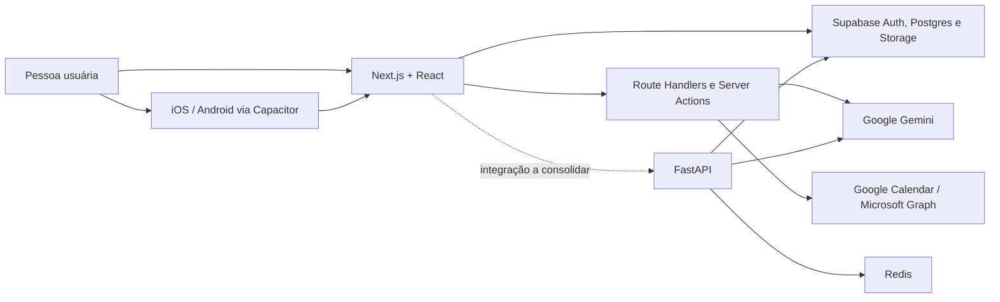

# FluvOS

Plataforma mobile-first de produtividade que reúne tarefas, foco, hábitos,
agenda, aprendizado e assistência por IA em uma única rotina operacional.

> **Estado atual:** produto em desenvolvimento. O repositório ainda contém o
> nome legado **Builders Performance** em metadados, identificadores nativos e
> partes da documentação. Consulte [Estado técnico e limitações](#estado-técnico-e-limitações)
> antes de preparar uma publicação.

## O que existe no produto

| Área | Rota principal | Escopo encontrado no código |
| --- | --- | --- |
| Início | `/inicio` | Visão diária, briefing, agenda, progresso e ações rápidas |
| Tarefas | `/tarefas` | Organização em Kanban, filtros, prioridades e formulários |
| Foco | `/foco` | Timer, sessões, histórico, estatísticas e associação com tarefas |
| Hábitos e metas | `/habitos` | Hábitos, categorias, check-ins, metas e planos de desenvolvimento |
| Agenda | `/agenda` | Eventos e interface de integração com calendários |
| Assistente | `/assistente` | Chat com Gemini, contexto do usuário, ações e briefing |
| Cursos | `/cursos` | Catálogo, módulos, aulas, progresso e notas |
| Perfil | `/perfil` | Dados pessoais, senha, avatar e preferências |
| Administração | `/admin` | Usuários, cursos, notificações e analytics |
| Autenticação | `/entrar`, `/criar-conta` | Login, cadastro, recuperação de senha e callback OAuth |

Também existem páginas de termos, privacidade e um catálogo interno do design
system em `/design-system`.

## Arquitetura

O repositório é um monorepo de aplicação. A interface Next.js atende web e é
empacotada com Capacitor para iOS e Android. Supabase concentra autenticação,
PostgreSQL, RLS e storage. O assistente possui duas implementações presentes no
código: Route Handlers do Next.js e uma API FastAPI separada.



### Stack principal

| Camada | Tecnologias |
| --- | --- |
| Frontend | Next.js 16, React 19, TypeScript 5, Tailwind CSS 4 |
| UI e estado | Radix UI, TanStack Query, React Hook Form, Zod, Framer Motion |
| Dados e autenticação | Supabase, PostgreSQL, RLS, Supabase SSR |
| IA | Google Gen AI / Gemini |
| Backend de IA | FastAPI, Pydantic, APScheduler, SSE, Redis |
| Mobile | Capacitor 8, Swift Package Manager, Gradle |
| Qualidade | ESLint, TypeScript, Vitest, Testing Library |

## Início rápido — aplicação web

### Pré-requisitos

- Node.js `>= 20.9.0`
- npm
- Um projeto Supabase acessível

### Instalação

```bash
git clone https://github.com/fluvosapp/fluvos-app.git
cd fluvos-app
npm install
```

Crie um arquivo `.env.local` na raiz. Não versione esse arquivo.

```dotenv
NEXT_PUBLIC_SUPABASE_URL=
NEXT_PUBLIC_SUPABASE_ANON_KEY=
```

Inicie o ambiente web:

```bash
npm run dev
```

A aplicação será servida em [http://localhost:3000](http://localhost:3000).
Sem as credenciais do Supabase, autenticação e funcionalidades persistidas não
estarão disponíveis.

## Variáveis de ambiente

### Next.js

| Variável | Uso | Necessidade |
| --- | --- | --- |
| `NEXT_PUBLIC_SUPABASE_URL` | URL pública do projeto Supabase | Base da aplicação |
| `NEXT_PUBLIC_SUPABASE_ANON_KEY` | Chave pública/anon do Supabase | Base da aplicação |
| `SUPABASE_SERVICE_ROLE_KEY` | Operações administrativas no servidor | Área administrativa |
| `GEMINI_API_KEY` | Chat e briefing pelo Route Handler do Next.js | Assistente IA |
| `CALENDAR_STATE_SECRET` | Assinatura do estado do OAuth | Integração de calendário |
| `GOOGLE_CLIENT_ID` | OAuth do Google Calendar | Calendário Google |
| `GOOGLE_CLIENT_SECRET` | OAuth do Google Calendar | Calendário Google |
| `GOOGLE_REDIRECT_URI` | Callback cadastrado no Google | Calendário Google |
| `MICROSOFT_CLIENT_ID` | OAuth do Microsoft Graph | Calendário Outlook |
| `MICROSOFT_CLIENT_SECRET` | OAuth do Microsoft Graph | Calendário Outlook |
| `MICROSOFT_REDIRECT_URI` | Callback cadastrado na Microsoft | Calendário Outlook |

Variáveis sem o prefixo `NEXT_PUBLIC_` são segredos de servidor. Nunca as
exponha no bundle cliente, em logs, screenshots, issues ou commits.

### FastAPI

O modelo de configuração está em [`backend/.env.example`](backend/.env.example).

| Variável | Uso | Valor padrão |
| --- | --- | --- |
| `GEMINI_API_KEY` | Acesso ao Gemini | — |
| `SUPABASE_URL` | URL do Supabase | — |
| `SUPABASE_SERVICE_ROLE_KEY` | Acesso privilegiado ao banco | — |
| `SUPABASE_JWT_SECRET` | Validação dos tokens emitidos pelo Supabase | — |
| `REDIS_URL` | Cache e rate limit | `redis://redis:6379/0` |
| `GEMINI_MODEL` | Modelo usado pelo serviço | Definido em `backend/app/config.py` |
| `RATE_LIMIT_PER_MINUTE` | Limite por pessoa usuária | `60` |
| `CONTEXT_CACHE_TTL` | TTL do contexto em segundos | `300` |

## Backend FastAPI

### Com Docker Compose

```bash
cp backend/.env.example backend/.env
# Preencha backend/.env antes de continuar.
docker compose -f backend/docker-compose.yml up --build
```

Serviços locais:

- API: [http://localhost:8000](http://localhost:8000)
- Swagger UI: [http://localhost:8000/docs](http://localhost:8000/docs)
- Health check: [http://localhost:8000/health](http://localhost:8000/health)
- Redis: `localhost:6379`

### Sem Docker

Requer Python 3.12 e uma instância Redis acessível.

```bash
cd backend
python3.12 -m venv .venv
source .venv/bin/activate
pip install -r requirements.txt
cp .env.example .env
# Para Redis local, use REDIS_URL=redis://localhost:6379/0.
uvicorn app.main:app --reload
```

### Endpoints do serviço

| Método | Endpoint | Finalidade |
| --- | --- | --- |
| `GET` | `/health` | Estado do Redis e do Supabase |
| `POST` | `/chat/stream` | Chat autenticado com resposta via SSE |
| `GET` | `/briefing` | Geração de briefing autenticado |
| `GET` | `/briefing/status` | Estado do briefing |
| `POST` | `/voice/transcribe` | Transcrição autenticada de áudio de até 25 MB |

Os endpoints de chat, briefing e voz exigem um JWT válido do Supabase.

## Banco de dados e Supabase

O schema usa tabelas em inglês e inclui domínios de usuários, tarefas, sessões
de foco, hábitos, metas, agenda, cursos, notificações, conversas e administração.
As políticas RLS e funções PostgreSQL ficam nas migrações versionadas.

- Configuração local: [`supabase/config.toml`](supabase/config.toml)
- Migrações adotadas: [`supabase/migrations/implementados/`](supabase/migrations/implementados/)
- Seed: [`supabase/seed.sql`](supabase/seed.sql)
- Visão do schema: [`supabase/docs/SCHEMA.md`](supabase/docs/SCHEMA.md)
- Auditoria: [`supabase/docs/DB-AUDIT.md`](supabase/docs/DB-AUDIT.md)

As migrações estão em uma subpasta não padrão (`implementados/`). Não presuma
que `supabase db reset` ou `supabase db push` irá descobri-las automaticamente.
Revise a ordem e o ambiente alvo antes de aplicar SQL.

## iOS e Android

O Capacitor usa o diretório `out/` como bundle web e mantém projetos nativos em
`ios/` e `android/`.

```bash
npm run build
npx cap sync
npx cap open ios
# ou
npx cap open android
```

Use Xcode para o projeto iOS e Android Studio para o projeto Android. Recursos
nativos configurados incluem splash screen, status bar, teclado, notificações e
tratamento do botão voltar.

O identificador atual é `com.builders.performance` e o nome nativo ainda é
`Builders Performance`. Renomeie ambos de forma coordenada antes de publicar o
FluvOS nas lojas.

## Comandos do projeto

| Comando | Função |
| --- | --- |
| `npm run dev` | Servidor de desenvolvimento Next.js |
| `npm run build` | Build/exportação configurada no Next.js |
| `npm run lint` | Análise estática com ESLint |
| `npm run typecheck` | Verificação TypeScript sem emissão |
| `npm test` | Suíte Vitest em execução única |
| `npm run test:watch` | Vitest em modo contínuo |
| `npm run test:coverage` | Cobertura da suíte Vitest |
| `npx cap sync` | Sincroniza o bundle e plugins com iOS/Android |

O `package.json` ainda contém scripts `sync:*` e `validate:*` que apontam para
`.aiox-core`, diretório removido do repositório. Esses scripts estão órfãos e
não devem ser usados até serem removidos ou substituídos.

## Estrutura do repositório

```text
app/             Rotas, layouts, Route Handlers e Server Actions do Next.js
componentes/     Componentes por domínio, layout, tema e biblioteca de UI
hooks/           Consultas, mutações e estado compartilhado do frontend
lib/             Supabase, IA, calendário, schemas, providers e utilitários
backend/app/     API FastAPI, routers, services, models e utilitários
supabase/        Configuração local, migrações, seed e documentação do banco
ios/             Projeto nativo iOS gerenciado pelo Capacitor
android/         Projeto nativo Android gerenciado pelo Capacitor
types/           Contratos TypeScript compartilhados
docs/            Especificações, auditorias, planos e relatórios históricos
public/          Assets públicos da aplicação web
```

Antes de editar, leia [`AGENTS.md`](AGENTS.md). O projeto estabelece limite
absoluto de 500 linhas por arquivo de código-fonte e exige preservação das
alterações não relacionadas presentes no worktree.

## Estado técnico e limitações

Estes pontos foram identificados diretamente no código em 16 de agosto de 2026:

1. `next.config.ts` usa `output: "export"`, enquanto o projeto também contém
   middleware, Route Handlers e Server Actions. Esses recursos exigem runtime
   de servidor e precisam de uma estratégia de implantação compatível antes de
   uma release web ou mobile.
2. O frontend chama `/api/calendario/connect`, `/sync` e `/disconnect`, mas os
   Route Handlers correspondentes não estão presentes na árvore atual.
3. Existem duas implementações do assistente: uma dentro do Next.js e outra em
   FastAPI. O caminho canônico de produção ainda precisa ser consolidado.
4. Nome, metadata, `appId`, scheme e cores nativas ainda carregam a identidade
   legada Builders Performance.
5. A raiz não possui arquivo de exemplo de ambiente. Use as tabelas deste README
   para criar `.env.local`; o backend mantém seu próprio exemplo.
6. Documentos em `docs/` foram produzidos em momentos diferentes. Para decisões
   técnicas, código, configuração e migrations atuais têm precedência.
7. O repositório não contém um arquivo de licença. Não presuma permissão de uso,
   modificação ou redistribuição fora da equipe responsável.

## Documentação relacionada

- [Escopo do produto](docs/escopo-do-projeto.md)
- [Páginas do app](docs/paginas-do-app.md)
- [Relatório consolidado](docs/RELATORIO-COMPLETO-APP.md)
- [Plano do frontend](docs/plano-frontend.md)
- [Especificação visual](docs/design-spec-v2.md)
- [Roadmap do design system](docs/design-system-roadmap.md)
- [Revisão do backend](docs/BACKEND-REVIEW.md)
- [Plano do backend de IA](backend/PLANO-BACKEND.md)

## Contribuição

1. Crie uma branch curta a partir da `main` atualizada.
2. Mantenha a alteração restrita ao objetivo declarado.
3. Atualize documentação e migrations quando contratos mudarem.
4. Execute primeiro a verificação mais estreita relevante; antes de release,
   registre claramente quais gates foram ou não executados.
5. Abra um pull request explicando impacto, validação e limitações conhecidas.

Última revisão deste README: **16 de agosto de 2026**.
