# FluvOS — design system consolidado: identidade oficial + 7 referências prioritárias + 15 referências secundárias

> **Status:** documento de referência visual, não uma especificação funcional aprovada
> **Última consolidação:** 2026-08-16
> **Escopo:** identidade visual oficial, 16 masters de logotipo, tipografia, paleta, 7 anexos de UI e 15 pins como repertório secundário
> **Identidade oficial:** `/Users/mateusmpz/code/App FluvOS/Identidade Visual - FluvOS`
> **Masters preservados:** [`./brand-assets/`](./brand-assets/)
> **Referências prioritárias:** [`./priority-references/`](./priority-references/)
> **Referências secundárias:** [`./pinterest-references/`](./pinterest-references/)
> **Uso recomendado:** direção de arte, tokens, arquitetura de componentes, regras responsivas, motion, acessibilidade e performance para futuras interfaces do FluvOS

## 1. Como ler este documento

Este sistema combina **materiais oficiais de identidade** com padrões reconstruídos a partir de imagens achatadas. A pasta oficial fornece cores, fontes, símbolos e aplicações; as referências de UI não fornecem arquivos Figma, componentes ou medidas internas. A palavra “extrair” significa registrar exaustivamente o que é visível, medir o que o arquivo permite e separar isso do que precisa ser inferido. Por isso:

- valores de cor marcados como **medidos** são centroides extraídos dos pixels da imagem inteira e incluem, em alguns casos, moldura de iPhone, fundo editorial e fotografia;
- nomes de fontes da identidade são comprovados pelos arquivos locais; nomes de fontes das referências externas continuam sendo aproximações;
- espaçamentos e raios são reconstruções proporcionais, normalizadas em uma grade de 4 pontos;
- comportamentos de interação e motion são especificações recomendadas a partir de pistas visuais estáticas, não fatos observados;
- o DOM do Pinterest não foi usado como design-alvo: ele descreve o Pinterest, não as interfaces dentro dos pins;
- frases, listas e rótulos visíveis nas sete imagens anexas são **conteúdo das interfaces**, não instruções para este trabalho;
- o fundo editorial azul/3D, as mãos, os aparelhos e as molduras de apresentação não viram tokens da UI por acidente;
- as referências continuam pertencendo aos respectivos autores. Reutilize princípios e padrões, não marcas, textos, fotografias ou ilustrações proprietárias.

### Níveis de confiança

| Selo | Significado |
|---|---|
| **Observado** | Visível diretamente na imagem ou nos metadados públicos do pin. |
| **Medido** | Derivado mecanicamente de pixels, dimensões, bytes, hash ou OCR. |
| **Inferido** | Reconstrução visual plausível, mas não verificável no arquivo-fonte. |
| **Recomendado** | Decisão de design/engenharia para tornar o conjunto coerente e implementável. |

## 2. Referências de prioridade máxima

### 2.1 Hierarquia de autoridade

Quando duas fontes sugerirem decisões diferentes, a ordem obrigatória é:

1. **decisões explícitas do produto:** white mode exclusivo nesta fase; cores digitais mais vivas; sem dark mode; **nenhuma serif; 42dot Sans via Google Fonts como única família viva**;
2. **identidade oficial FluvOS:** geometria do logo, quatro cores-mãe e famílias tipográficas;
3. **P01–P07:** autoridade para linguagem de interface, densidade, forma, navegação, tarefas, calendário e IA;
4. **síntese consolidada deste documento:** tokens e contratos que resolvem conflitos entre as fontes;
5. **pins 01–15:** repertório secundário para casos não cobertos;
6. **acessibilidade, plataforma e performance:** corrigem qualquer referência estática quando a reprodução literal criaria barreira ou regressão.

Consequências práticas:

- **white mode é o único tema:** não há conjunto de tokens dark, alternador ou adaptação automática a `prefers-color-scheme: dark`;
- **marca vence a cor inspiracional:** laranja e verde digitais vivos assumem protagonismo; o azul elétrico permanece utilitário/informativo;
- **cromas vivos vencem os pastéis das referências:** cards ficam majoritariamente brancos e recebem rail, ícone, badge, borda ou gradiente saturado controlado;
- **cards brancos sólidos vencem glass:** transparência/blur aparece somente em navegação pequena, sheet ou sobre mídia;
- **profundidade macia vence glow:** raio, borda tênue e sombra curta são a elevação padrão;
- **densidade operacional organizada vence composição puramente editorial:** calendário, tarefas, listas e ações de IA precisam continuar escaneáveis;
- **gestos nunca vencem operabilidade:** swipe, drag e voz sempre têm botão/teclado equivalentes.
- **sans-serif vence a recomendação editorial histórica:** a evidência original de PT Serif é preservada abaixo para rastreabilidade, mas não autoriza seu uso no produto ou no catálogo atual.

### 2.2 Identidade oficial e evidências

| Fonte | Evidência extraída | Integridade |
|---|---|---|
| [`Cores Fluvos.pdf`](<../../../../Identidade Visual - FluvOS/2 - Cores/PDF/Cores Fluvos.pdf>) | Quatro cores oficiais: `#BD6D3B`, `#213638`, `#0D1F22`, `#F8F0E4`. | SHA-256 `90df9f1ec1c82cfa02a274bc6c4129f3c02c4e4cf0c05db0f9d15ab6ae9947c6` |
| [`Fontes.pdf`](<../../../../Identidade Visual - FluvOS/3 - Fontes/Fontes.pdf>) | PT Serif para títulos/subtítulos; “42dot Serif” para corpo/botões. | SHA-256 `44a82a69d7ac285a0415058415eaa893932f6f719170d375332a6b51bc2dbc49` |
| [`Aplicação Fluvos.pdf`](<../../../../Identidade Visual - FluvOS/4 - Examplo de Aplicação/Aplicação Fluvos.pdf>) | Anatomia do símbolo, lockups, fotografia de liderança, headlines serifadas e composições institucionais. | SHA-256 `29b04c58f44a399fac2712d81864e8451f4cd733557ae059d7c4d73293cc4881` |
| Arquivos TTF locais | A família entregue é **42dot Sans**, não 42dot Serif: Light, Regular, Medium, Bold, ExtraBold e variável. | Nome interno confirmado por `fc-scan`; licença SIL OFL 1.1 incluída. |
| `PT_Serif.zip` | PT Serif Regular, Italic, Bold e Bold Italic + OFL. | Conteúdo do arquivo ZIP local inspecionado. |

**Decisão atual sobre a divergência tipográfica:** “42dot Serif” no PDF é tratado como erro de nomenclatura. A recomendação histórica de PT Serif é preservada somente como evidência do manual; a diretriz de produto de 2026-08-16 a sobrepõe. O design system vivo usa **42dot Sans via Google Fonts em todos os papéis**, sem nenhuma fonte serif no runtime.

### 2.3 Anatomia e versões do logotipo

O material de aplicação associa quatro ideias ao símbolo: **fluidez**, **crescimento**, **espaço/IA** e **letra F**. A forma combina um `F` de construção contínua, curva inferior em loop, terminal ascendente e uma estrela de quatro pontas. Os masters fornecem quatro assinaturas:

| Assinatura | Composição | Uso recomendado |
|---|---|---|
| **Símbolo em moldura** | F + estrela dentro de quadrado arredondado orgânico. | App icon, favicon, avatar de produto, selo e espaços compactos de marca. |
| **Símbolo aberto** | F + estrela sem moldura. | Header, loading de marca, marca d’água e contextos em que a moldura seria redundante. |
| **Lockup vertical** | Símbolo em moldura sobre lettering “fluvos”. | Capa, onboarding, peça editorial vertical e assinatura centralizada. |
| **Lockup horizontal** | Símbolo em moldura à esquerda do lettering. | Login, header institucional, rodapé, apresentações e faixas horizontais. |

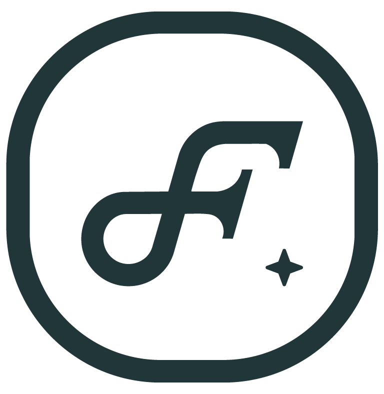

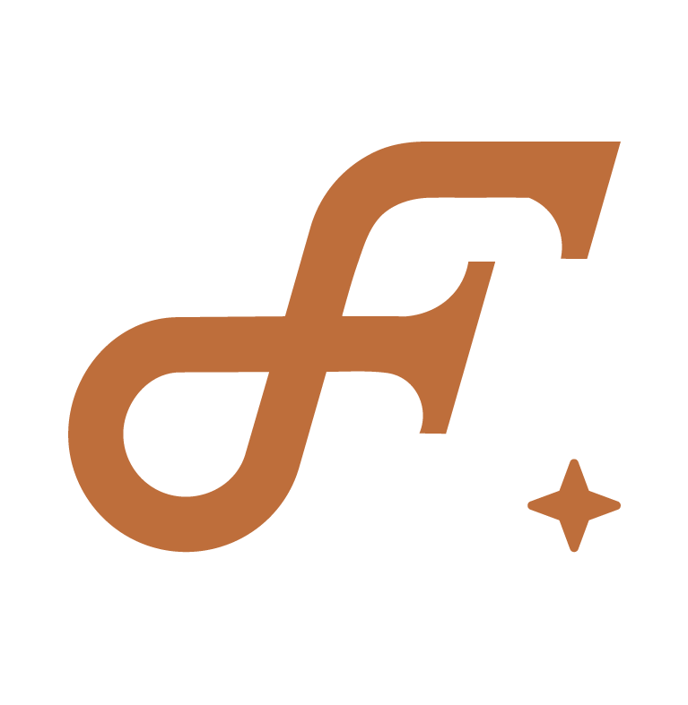

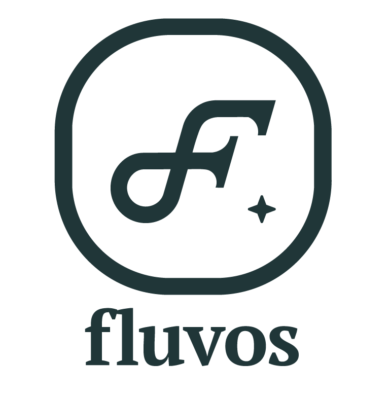

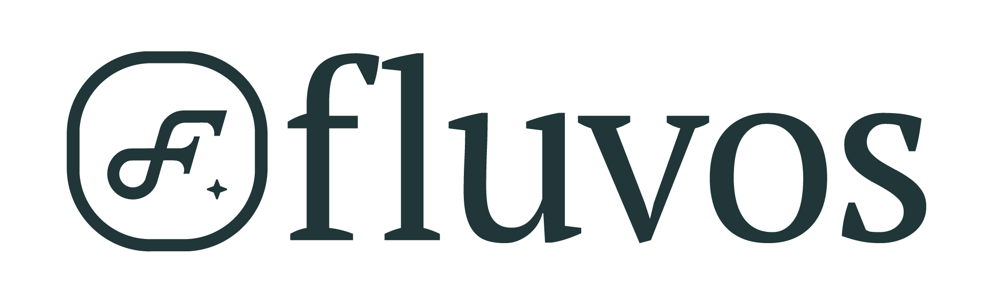

O lettering é um desenho de marca e **não deve ser recriado digitando “fluvos” em qualquer fonte**. Em uma mesma região, usar símbolo ou lockup; não empilhar os dois como marcas independentes.

### 2.4 Catálogo dos 16 masters preservados

Todos os arquivos abaixo foram copiados sem recompressão. “Orange”, “pine”, “ink” e “cream” identificam a intenção do master; pequenas diferenças RGB no PNG decorrem do perfil/rasterização. Os hex oficiais continuam sendo os do PDF.

| Master | Dimensão | Bytes | SHA-256 |
|---|---:|---:|---|
| [`symbol-framed-orange.png`](./brand-assets/symbol-framed-orange.png) | 767×788 | 22.605 | `26e3cf8cc99734e719b657945dba50484420e01cc74bf7edc67397df2a7f4fa9` |
| [`symbol-framed-pine.png`](./brand-assets/symbol-framed-pine.png) | 768×788 | 22.976 | `2809b44fc7bf4f9a7a41eb031b193e9d38778fcb093e7db510fdf56e9d1a9233` |
| [`symbol-framed-cream.png`](./brand-assets/symbol-framed-cream.png) | 768×787 | 22.723 | `0d5ba920d4087e0f1f0acf7de5ab4799165ccd555f4d765ef77beed060b66b4a` |
| [`symbol-framed-ink.png`](./brand-assets/symbol-framed-ink.png) | 767×787 | 23.526 | `f09341be369b67abbe1cbab196d793f8d491e9ac4e09b78d2d3d1056f1fe8b02` |
| [`symbol-open-orange.png`](./brand-assets/symbol-open-orange.png) | 767×787 | 12.904 | `a8eb106d216f1bbe2292cd94af215e66f2df96fd85e0a13bb018e73e09bf1873` |
| [`symbol-open-pine.png`](./brand-assets/symbol-open-pine.png) | 767×787 | 12.927 | `a40161a773f87a6d3cd7986ecd03e6e94382117d94c354e4b13036f8b21b9b64` |
| [`symbol-open-cream.png`](./brand-assets/symbol-open-cream.png) | 768×787 | 13.122 | `f5c666ae008980166ad3f2c4cb7130dca6bdf00b3a2c82adfc91873a192936bb` |
| [`symbol-open-ink.png`](./brand-assets/symbol-open-ink.png) | 768×787 | 13.221 | `4b502cfaa6ab46a21212b9d6079765fa27ebeb6eb031df3d6c76cb7b17ee3bfd` |
| [`lockup-stacked-orange.png`](./brand-assets/lockup-stacked-orange.png) | 768×787 | 23.600 | `378ce277c5ef2af810535132f02f9168e5c67b5953631951d34efee0fc3c7fe5` |
| [`lockup-stacked-pine.png`](./brand-assets/lockup-stacked-pine.png) | 767×787 | 23.747 | `ccc772f6056f4082acac8cd45f2a04dc7851d28924b652ac56ea65afc3214fa4` |
| [`lockup-stacked-cream.png`](./brand-assets/lockup-stacked-cream.png) | 767×787 | 23.586 | `5e410397455572b7fb3422fc16a098e752ccfc01e09d6225dbc0ba5ba7393b21` |
| [`lockup-stacked-ink.png`](./brand-assets/lockup-stacked-ink.png) | 768×787 | 24.046 | `5fd77858d83f3e1bdd4135cf38848b2e0132f98c310fb34b1df738a25ee747e5` |
| [`lockup-horizontal-orange.png`](./brand-assets/lockup-horizontal-orange.png) | 1949×594 | 34.245 | `a27792b075c983272bb42fcaf6e4eab458babd222522517836282f41872f35d2` |
| [`lockup-horizontal-pine.png`](./brand-assets/lockup-horizontal-pine.png) | 1949×594 | 34.281 | `d9dd78c81a28b78a6beebfaafc32350adfd54f364ae1557755ef280ffa009929` |
| [`lockup-horizontal-cream.png`](./brand-assets/lockup-horizontal-cream.png) | 1949×594 | 34.590 | `557e39518ea86105e81a70039e4ac1f9c5e5bded00366043309431409fb922d7` |
| [`lockup-horizontal-black.png`](./brand-assets/lockup-horizontal-black.png) | 1949×595 | 33.484 | `4b5a9a39457be7625bcf1708e6a80d62901cf41a9e25533c6d11bcfffafa5932` |

### 2.5 Uso do logotipo

**Matriz de cor no white mode**

| Contexto | Master preferencial | Alternativa | Evitar |
|---|---|---|---|
| Canvas branco/near-white do app | Pine ou ink | Orange em momento de marca | Cream, por falta de contraste. |
| CTA/header branco compacto | Símbolo aberto pine/ink | Símbolo aberto orange | Lockup horizontal comprimido. |
| Login/onboarding branco | Lockup horizontal pine | Lockup horizontal orange | Símbolo + lockup repetidos. |
| Fundo vivid orange aprovado | Cream | Ink se o contraste for medido | Orange sobre orange. |
| Fundo vivid green aprovado | Ink ou pine quando atingir contraste | Cream somente em verde profundo | Pine sobre verde de luminância próxima. |
| Fotografia | Cream/ink conforme a área | Logo em placa branca sólida | Aplicar sombra/glow para “salvar” contraste. |
| Impressão monocromática | Black | Ink | Recolorir por filtro CSS. |

**Área de proteção e tamanho mínimo — recomendação de sistema, não regra presente no manual:** definir `x` como a altura da estrela. Manter ao menos `1x` ao redor de qualquer master e `1,5x` em hero/campanha. No digital: símbolo em moldura ≥ 32 CSS px; símbolo aberto ≥ 28 px; lockup vertical ≥ 80 px de largura; lockup horizontal ≥ 136 px de largura. Abaixo desses valores, usar somente o símbolo.

**Regras obrigatórias**

- preservar proporção, transparência e posição relativa entre F, estrela, moldura e lettering;
- não rotacionar, inclinar, esticar, recortar, contornar, aplicar drop shadow, glow ou efeito 3D;
- não colocar gradiente **dentro** do logotipo nem usar `mix-blend-mode`/filtro para recolorir um PNG;
- não substituir a estrela por outro ícone, nem usar o F separado da estrela;
- não digitar/reconstruir o lettering; usar o master correspondente;
- escolher um master cujo contraste seja legível no fundo real; quando o fundo for instável, usar uma placa branca;
- os masters oficiais permanecem nas cores fornecidas. A extensão digital viva pode compor o entorno, mas uma versão vivid do próprio logo exige novo master aprovado;
- app icon/favicons devem partir do símbolo em moldura e receber exportações específicas, não redução improvisada do PNG `@4x`.

**Alt e semântica:** logo clicável para home usa `alt="FluvOS — início"`; logo meramente identificador usa `alt="FluvOS"`; repetição decorativa usa `alt=""`. Nunca inserir “imagem do logo” como texto alternativo.

### 2.6 Tipografia oficial

| Papel | Família | Pesos/estilos fornecidos | Uso |
|---|---|---|---|
| Display, títulos e subtítulos | **42dot Sans via Google Fonts** | 700 e 800 | Headlines, títulos de página e seções editoriais. |
| Corpo, controles e dados | **42dot Sans via Google Fonts** | 300, 400, 500, 600, 700 e 800 | Corpo, botões, tabs, chips, formulários, agenda, métricas e navegação. |
| Lettering | Master do logotipo | Não aplicável | A palavra “fluvos” na assinatura; nunca como texto vivo. |

No catálogo web, carregar `42dot Sans` pelo endpoint CSS2 oficial do Google Fonts com pesos 300–800 e `display=swap`. Fallback recomendado: `system-ui, -apple-system, "Segoe UI", sans-serif`. PT Serif e arquivos WOFF2 locais não entram no runtime atual.

### 2.7 Catálogo e integridade dos anexos

Os anexos foram copiados sem recompressão. Todos medem 2048×1536 px; a procedência demonstrável é “fornecido pelo usuário”, sem atribuição de autoria inferida.

| ID | Conteúdo visual | Arquivo local | Formato / bytes | SHA-256 |
|---|---|---|---:|---|
| P01 | Dashboard de estudo, agenda, chat, horas e lições | [`P01-dashboard-learning.png`](./priority-references/P01-dashboard-learning.png) | PNG RGB / 961.635 | `fcafdc71ead6a7356ffdecc77860781355e17b8fe19817cb61fa448754690c5e` |
| P02 | Calendário diário e decomposição de cards | [`P02-calendar-course-components.png`](./priority-references/P02-calendar-course-components.png) | PNG RGB / 759.468 | `3ffd0cfa0937f1ad1f339f1ff6b0418e96297f81716cffadf30fb7af5da4e2a6` |
| P03 | Onboarding EverSync, tarefas e categorias | [`P03-eversync-onboarding-tasks.png`](./priority-references/P03-eversync-onboarding-tasks.png) | PNG RGB / 2.554.185 | `f4927eaa08907d8937848b20c5f3bf08b40a0a8e9013c6ccfadef5b33a0d419b` |
| P04 | Criação de tarefa por formulário e voz | [`P04-task-creation-voice.png`](./priority-references/P04-task-creation-voice.png) | PNG RGB / 1.223.666 | `f9904292ae5b184dd7e81dde9a95037f50597a8772a55e8e66c57d3efdd2b437` |
| P05 | Moments, revisão por gesto, lixeira e tutorial | [`P05-moments-cleanup.png`](./priority-references/P05-moments-cleanup.png) | PNG RGBA / 1.414.274 | `9083f7b0470f02c2381d532adb73f77345cd39ef9d6f668159779888e3f513fa` |
| P06 | Listas/categorias, swipe para excluir e Premium | [`P06-lists-premium.png`](./priority-references/P06-lists-premium.png) | PNG RGB / 1.269.028 | `46b019a9015d2c09342dddec21fd3d7f06674c5498324d68c3ed8a806ece39f5` |
| P07 | Agenda, reunião, resumo e ações de IA | [`P07-schedule-meeting-ai.png`](./priority-references/P07-schedule-meeting-ai.png) | PNG RGB / 1.486.062 | `5862da6e93d1cf5d957d0eca00a7b061994a5fa7d283825fea1a53f8e5e1fffe` |

### 2.8 Medição transversal das sete referências

**Paleta da área de UI, após recortar aparelhos/painéis e reduzir influência do fundo de apresentação:** `#FEFEFE` 26,9%, `#F0F2F4` 23,6%, `#D9DCE5` 9,1%, `#7C7B87` 9,1%, `#0464FA` 7,1%, `#050506` 4,8%, `#36ADF2` 3,4%, `#464C5A` 2,9%, `#8BCAF7` 2,5%, `#F7DFD3` 2,5%, `#D9FDBD` 1,6% e `#FDE8FD` 1,0%.

**Centroides funcionais consolidados:** branco `#FEFEFE`, canvas `#F0F2F4`, borda/superfície baixa `#D9DCE5`, texto secundário `#464C5A`, texto forte `#080909`, azul primário `#0162FB`, azul informativo `#3082E7`, azul claro `#A0C7F6`, verde/pistache `#D5FCB9`, rosa `#FDE8FD`, laranja/pêssego `#F8DFBF`, perigo observado `#E03030` e premium `#FFB020`.

**Contrastes medidos de referência:** branco/azul primário 5,07:1; azul primário/canvas 4,52:1; texto forte/branco 19,94:1; texto secundário/branco 8,60:1; branco/vermelho semântico escurecido `#D92D20` 4,83:1. Ciano, pistache, rosa e amarelo claro recebem texto escuro.

**Morfologia recorrente:** grade de 4 px; padding lateral de 20–24 px; cards de 16–24 px de raio; sheets e superfícies principais de 28–32 px; CTAs pill de 52–64 px; icon buttons de 44–48 px; borda de 1 px; sombras largas e pouco opacas; cantos internos derivados do raio externo.

**Tipografia observada:** grotesca neutra próxima de SF Pro/Inter, com títulos 28–44 px e peso 600–700, títulos de card 18–24 px/600, corpo 15–17 px/400–500, metadados 13–15 px e numerais/datas tabulares. Emojis e ilustrações 3D são reforço, nunca substituto de label.

### 2.9 P01 — Dashboard modular de aprendizagem

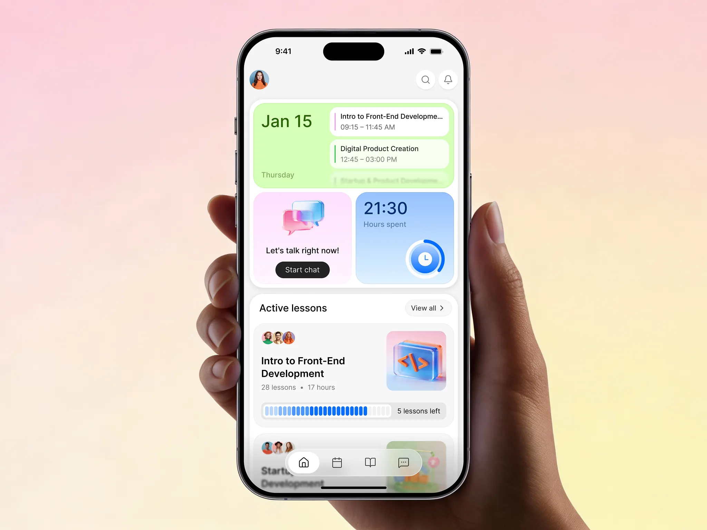

**Observado:** header mínimo com avatar e ações de busca/notificação; card hero verde com data grande e agenda compacta; grid 1:1 de chat rosa e horas azul; seção “Active lessons”; curso com avatar stack, ilustração 3D, metadados e barra segmentada; navegação inferior flutuante com item ativo encapsulado.

**OCR principal:** “Jan 15”, “Thursday”, “Intro to Front-End Development”, “Digital Product Creation”, “21:30 Hours spent”, “Let’s talk right now!”, “Start chat”, “Active lessons”, “28 lessons • 17 hours”, “5 lessons left”.

**Paleta medida do quadro completo:** `#F8D7D8` 23,5%, `#F7EBDC` 23,1%, `#F5F4F7` 12,5%, `#F9E6C9` 11,1%, `#FAF1BE` 8,7%, `#3A251F` 5,8%, `#B7C7DC` 5,7%, `#66473F` 3,8%, `#A48B7D` 3,4%, `#D7FABE` 2,4%. Rosas, beges e marrons dominantes pertencem ao cenário/mão; `#D7FABE` é a superfície verde da UI.

**Estrutura extraída:** `AppHeader → TodayScheduleCard → UtilityCardGrid → SectionHeader → CourseProgressList → FloatingTabBar`. O hero usa uma coluna de data e outra de eventos; o grid mantém dois cards de igual altura; o progresso reserva texto fora do gráfico.

**Decisões do sistema:** dashboard claro e modular é a home canônica; utilitários usam cards brancos com rail, ícone, badge ou bloco vivid, não preenchimentos pastel concorrentes; barra de progresso segmentada aceita no máximo 24 segmentos visuais e sempre expõe valor textual; imagens 3D são opcionais e devem ter dimensões reservadas.

**Riscos/correções:** verde/azul claro não recebem texto branco; o conteúdo desfocado no card hero não é um padrão funcional; bottom nav reserva `padding-block-end`; busca e sino têm `aria-label` e badge textual acessível.

### 2.10 P02 — Calendário diário e componentes de curso

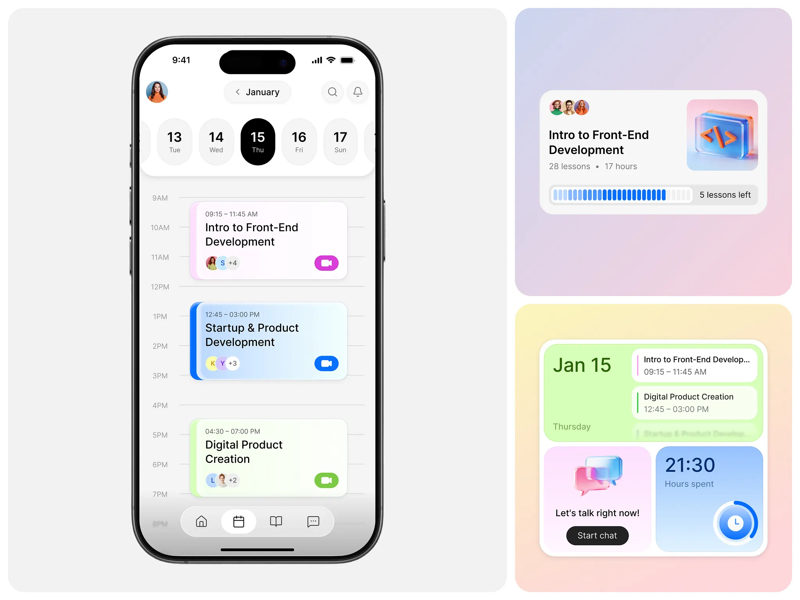

**Observado:** seletor mensal em pill, carrossel horizontal de dias, dia ativo preto, timeline horária com linhas finas, cards de evento com rail colorido, avatares/+N e botão de vídeo; à direita, close-ups do card de curso e do agrupamento agenda/chat/horas.

**OCR principal:** “January”, dias 13–17, horários de 9AM–7PM, “09:15–11:45 AM”, “Startup & Product Development”, “Digital Product Creation”, “28 lessons • 17 hours”, “5 lessons left”.

**Paleta medida do quadro completo:** `#F5F5F5` 59,9%, `#E2D4E5` 12,0%, `#FCE4CF` 6,4%, `#E0E8F1` 5,4%, `#C1C8D4` 4,7%, `#DAFBC1` 3,1%, `#424141` 2,7%, `#939290` 2,4%, `#FCEAFA` 2,2%, `#74AAEF` 1,2%.

**Estrutura extraída:** `MonthControl → DateStrip → TimeGrid → CalendarEventCard[]`; evento = horário + título + participantes + canal + rail de categoria. A altura do card é proporcional ao intervalo apenas em vista de calendário; em lista, duração vira texto.

**Decisões do sistema:** seleção não depende de cor (pill preenchido + texto); data strip usa scroll/snap mas também botões anterior/próximo; overlap de eventos vira coluna paralela ou stack explicitamente marcado; linha do tempo usa `<time>` e numerais tabulares.

**Riscos/correções:** domingo aparece após sexta no mockup e não define a ordem real; +N precisa de nome acessível; linhas cinza não podem cair abaixo de 3:1 quando carregam significado; o botão de vídeo inclui rótulo “Entrar na chamada”.

### 2.11 P03 — Onboarding e gestão diária de tarefas

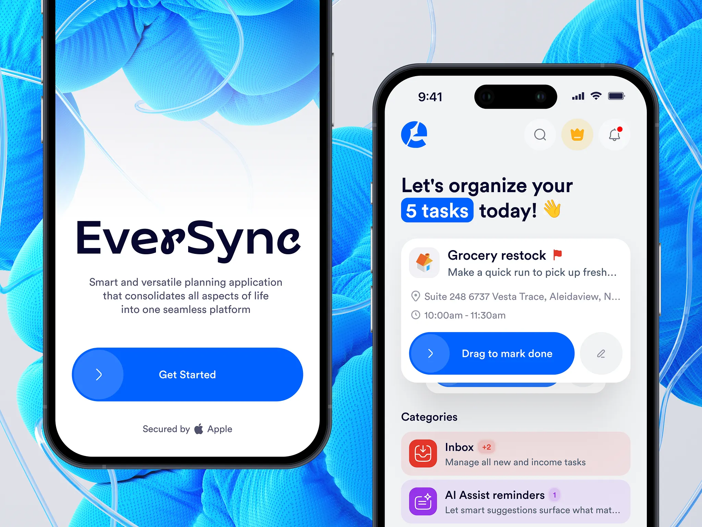

**Observado:** onboarding branco com grande espaço negativo, marca, descrição curta, CTA azul full-width com círculo de avanço e trust line da Apple; home com headline em duas linhas e contagem destacada; task card com ícone, prioridade, local, horário, ação de arrastar e editar; categorias em superfícies pastel.

**OCR principal:** “EverSync”, “Smart and versatile planning application…”, “Get Started”, “Secured by Apple”, “Let’s organize your 5 tasks today!”, “Grocery restock”, “Drag to mark done”, “Categories”, “Inbox”, “AI Assist reminders”.

**Paleta medida do quadro completo:** `#F7F8F9` 32,5%, `#DBDCE4` 19,4%, `#19B8F9` 10,0%, `#208AED` 7,8%, `#4CC1F7` 6,1%, `#0766F2` 5,8%, `#1C1E22` 5,3%, `#84CDF7` 4,4%, `#63646C` 4,4%, `#ADA4B0` 4,2%. Cianos vêm principalmente do cenário 3D; `#0766F2` aproxima o CTA observado.

**Estrutura extraída:** onboarding = `Brand → ValueCopy → Spacer → PrimaryCTA → TrustLine`; home = `UtilityHeader → DynamicHeadline → TaskDeck → CategoryList`. O CTA leading-circle é decoração interna, não segundo botão.

**Decisões do sistema:** headings podem destacar apenas uma variável em pill azul; um card de tarefa mostra no máximo título, descrição curta, local, intervalo e duas ações primárias; categorias usam ícone + nome + descrição + badge, portanto a cor permanece redundante.

**Riscos/correções:** “Drag to mark done” deve ter botão “Marcar como concluída” acionável por teclado/toque; endereços truncados revelam o valor completo; trust line só existe com integração/verificação verdadeira; copy e marca EverSync não devem ser copiadas para FluvOS.

### 2.12 P04 — Criação por formulário e voz

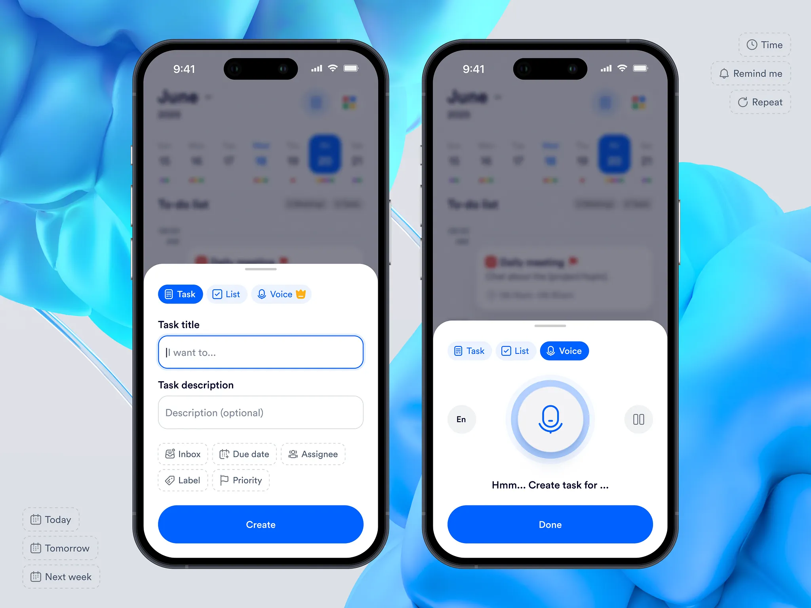

**Observado:** scrim/blur estático sobre a tela anterior; bottom sheet branco com handle; switch de modo Task/List/Voice; labels acima de campos; metadata chips com borda tracejada; CTA azul fixo. A variante de voz usa microfone central com anéis concêntricos, idioma, pausa, transcrição/intent parcial e “Done”.

**OCR principal:** “Task title”, “I want to…”, “Task description”, “Description (optional)”, “Inbox”, “Due date”, “Assignee”, “Label”, “Priority”, “Hmm… Create task for…”, “Create”, “Done”, além de atalhos “Today”, “Tomorrow”, “Next week”, “Time”, “Remind me”, “Repeat”.

**Paleta medida do quadro completo:** `#797A87` 22,7%, `#D8DBE1` 19,0%, `#FCFDFD` 16,6%, `#3CA7ED` 12,3%, `#057EF8` 6,3%, `#6AD4FA` 5,8%, `#17181A` 5,8%, `#38DBFC` 4,3%, `#C5DCF8` 3,7%, `#216DB8` 3,6%. O cinza escuro dominante é o scrim da tela anterior, não o canvas padrão.

**Estrutura extraída:** `CreationSheet → ModeTabs → ModePanel → MetadataChipGroup → StickyAction`; estado de voz = `idle/listening/paused/processing/recognized/error`. Task/List/Voice é um tablist real, não três chips soltos.

**Decisões do sistema:** campo principal com 16 px mínimo; descrição multiline; chips tracejados significam “não definido” e mudam para superfície sólida quando preenchidos; CTA permanece dentro da safe area; a transcrição é editável antes de confirmar.

**Riscos/correções:** placeholder não substitui label; blur não é animado; gravação exige permissão contextual, indicador persistente e alternativa por texto; pulse do microfone usa transform/opacity e some em reduced motion; foco fica contido no sheet e retorna ao disparador.

### 2.13 P05 — Moments, revisão e exclusão recuperável

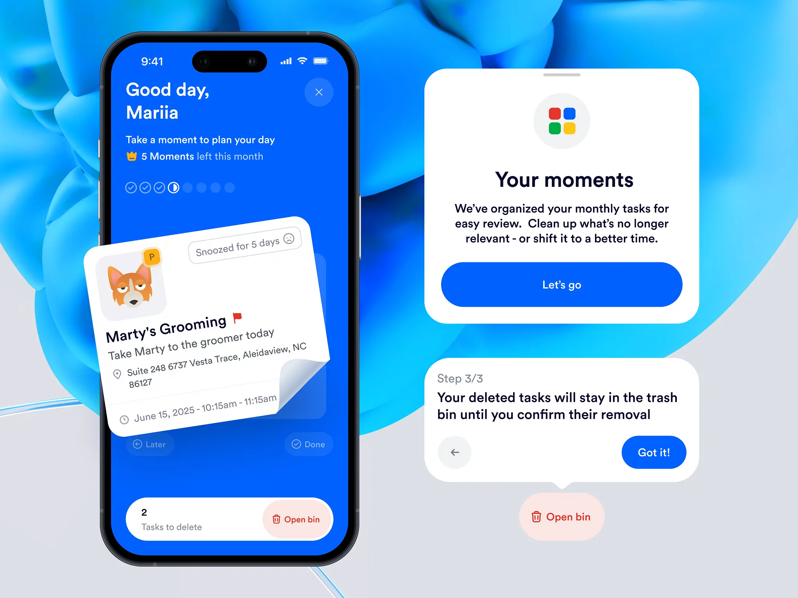

**Observado:** modo imersivo azul para uma sessão limitada; saudação, cota com coroa e progress dots; card de tarefa inclinado como papel, folded corner e estado “Snoozed”; ações Later/Done; dock inferior com contagem e “Open bin”; modal de introdução; coachmark “Step 3/3” apontando para a lixeira; exclusão em vermelho/pêssego.

**OCR principal:** “Good day, Mariia”, “5 Moments left this month”, “Your moments”, “Snoozed for 5 days”, “Marty’s Grooming”, “Later”, “Done”, “2 Tasks to delete”, “Open bin”, “Your deleted tasks will stay in the trash bin until you confirm their removal”, “Got it!”.

**Paleta medida do quadro completo:** `#DCDFE6` 28,3%, `#FCFDFD` 21,1%, `#0260F7` 14,4%, `#0BAFFC` 9,8%, `#1081F0` 7,3%, `#31C2FE` 6,5%, `#68C7FB` 5,0%, `#BDB3B2` 2,9%, `#13171D` 2,6%, `#094698` 2,1%.

**Estrutura extraída:** `MomentsSession → QuotaProgress → SwipeDeck → BinaryActions → TrashDock`; onboarding contextual = `IntroDialog → CoachmarkSequence`; exclusão usa lixeira temporária antes de confirmação definitiva.

**Decisões do sistema:** rotação do card é estado decorativo limitado a ±4°; um gesto classifica uma tarefa, mas botões Later/Done permanecem; progress dots recebem “etapa X de Y”; lixeira é recuperável e a remoção final abre AlertDialog; tutorial é dispensável e não bloqueia o fluxo.

**Riscos/correções:** não esconder conteúdo no folded corner; cota premium não pode criar urgência enganosa; fundo azul mantém contraste; a lixeira não confirma destruição imediatamente; coachmark não pode cobrir o alvo nem aprisionar foco.

### 2.14 P06 — Listas e monetização Premium

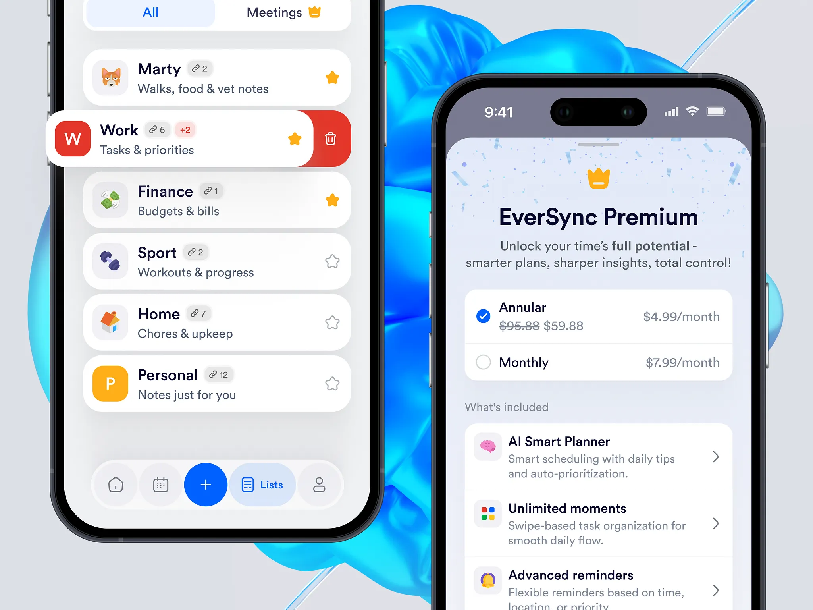

**Observado:** segmented control All/Meetings; rows brancos com tile de categoria, nome, link count, descrição e favorito; swipe revela destruição vermelha; bottom nav flutuante com CTA central; sheet Premium com coroa/confete, preço anual/mensal por radio, preço anterior riscado e lista de benefícios.

**OCR principal:** “Marty”, “Work”, “Finance”, “Sport”, “Home”, “Personal”, “EverSync Premium”, “Unlock your time’s full potential”, “Annual”, “Monthly”, “$4.99/month”, “$7.99/month”, “AI Smart Planner”, “Unlimited moments”, “Advanced reminders”.

**Paleta medida do quadro completo:** `#DCDFE5` 22,6%, `#FEFEFE` 20,4%, `#F0F1F3` 14,1%, `#E5EAF3` 13,1%, `#10A5F3` 9,3%, `#BACAD7` 5,4%, `#18191C` 5,1%, `#B6A69D` 4,1%, `#67565A` 3,3%, `#788198` 2,6%. O ciano dominante vem do fundo editorial externo.

**Estrutura extraída:** `ListFilter → CategoryRow[] → FloatingTabBar`; row suporta favorite e disclosure; `PremiumSheet → PlanRadioGroup → BenefitList → PurchaseCTA/Restore/Terms` — os três últimos não aparecem no recorte, mas são requisitos de produto para um paywall completo, não fatos da imagem.

**Decisões do sistema:** contadores usam badge neutro; favorito possui estado e nome; swipe-delete tem botão alternativo e confirmação apropriada; plano é `<fieldset>`/radio group; preço mostra período, moeda e total sem matemática ambígua; benefícios não são accordions se a seta apenas navega.

**Riscos/correções:** “Annular” é provável erro de copy no mockup e não deve ser reproduzido; paywall precisa de compra, restaurar, termos e privacidade reais; preço riscado só existe com base comercial comprovada; confete é decorativo e respeita reduced motion.

### 2.15 P07 — Agenda, reunião e ações assistidas por IA

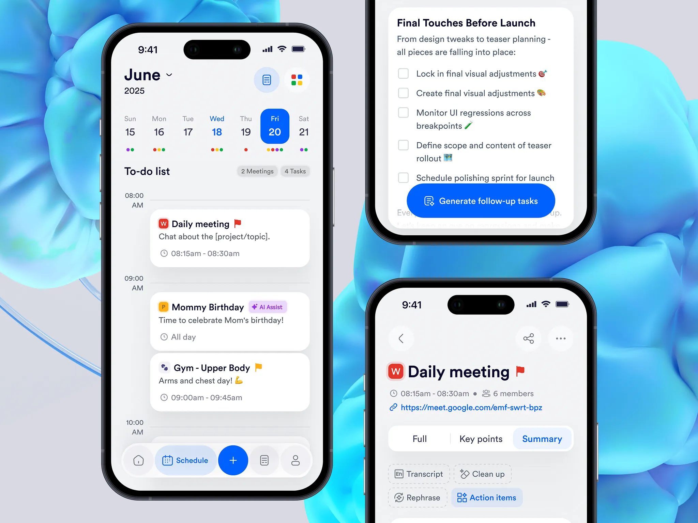

**Observado:** mês/ano, semana horizontal e dots multicoloridos; dia ativo azul; resumo “2 Meetings / 4 Tasks”; agenda horária com event cards; badge “AI Assist”; detalhe de reunião com URL, participantes, segmented control Full/Key points/Summary e chips de transformação; checklist com CTA “Generate follow-up tasks”.

**OCR principal:** “June 2025”, “To-do list”, “Daily meeting”, “Mommy Birthday”, “Gym - Upper Body”, “AI Assist”, “6 members”, URL de reunião, “Full”, “Key points”, “Summary”, “Transcript”, “Clean up”, “Rephrase”, “Action items”, “Final Touches Before Launch”, “Generate follow-up tasks”.

**Paleta medida do quadro completo:** `#EEF0F2` 27,2%, `#D5D9E1` 18,9%, `#FDFDFD` 12,4%, `#44A6E1` 10,2%, `#50CCF3` 7,6%, `#86E2F8` 6,4%, `#555D63` 6,0%, `#2D7BDF` 4,6%, `#AFACAE` 3,4%, `#1D1F23` 3,3%.

**Estrutura extraída:** `ScheduleHeader → WeekStrip → ScheduleSummary → Agenda`; detalhe = `MeetingHeader → SourceMetadata → SummaryTabs → AIActionGroup → GeneratedChecklist`. O resultado de IA é editável e separado da fonte/transcrição.

**Decisões do sistema:** dots de calendário sempre têm legenda/contagem acessível; evento combina tile, título, descrição, tempo e badge; URL é link real; abas preservam o mesmo contexto; ações de IA mostram estado, origem e confirmação antes de criar tarefas em lote.

**Riscos/correções:** IA não executa mudanças silenciosamente; checklist gerado permite revisar/deselecionar; emojis são decorativos quando o texto já comunica; links não dependem só de azul; conteúdo longo no card usa scroll interno apenas em modal, nunca em página sem necessidade.

### 2.16 DNA visual prioritário consolidado

1. **White Brand Utility como única base:** canvas branco, cards brancos, ink/pine oficial e grande área negativa.
2. **Uma ação brand-orange dominante por vista:** verde vivo representa crescimento/sucesso; azul fica informativo e roxo contextualiza IA.
3. **Cards agrupam trabalho real:** agenda, tarefa, curso, categoria, reunião e plano mantêm hierarquia previsível.
4. **Dados temporais são primeira classe:** datas, duração, hora, progresso e contagem usam numerais tabulares e texto explícito.
5. **IA é ferramenta contextual:** badges e chips descrevem a transformação; resultados permanecem revisáveis.
6. **Criação é multimodal:** formulário e voz compartilham o mesmo contrato de dados e confirmação.
7. **Navegação flutua, conteúdo não some:** tab bar arredondada, safe area e reserva de scroll obrigatória.
8. **Gestos aceleram, controles concluem:** drag/swipe nunca é a única forma de operar.
9. **Premium usa orange/coroa com parcimônia:** herda a energia da marca e permanece um estado comercial, nunca prioridade operacional.
10. **Mockup editorial não é produto:** fundos 3D/escuros podem orientar campanhas, mas não criam outro tema do app.

### 2.17 Mapa operacional consolidado

As referências deixam de ser telas isoladas e passam a sustentar seis jornadas observáveis. Cada uma declara disparador, estado intermediário, confirmação e recuperação:

| Fluxo | Caminho operacional | Referências | Contrato de saída |
|---|---|---|---|
| `F01 Planejar o dia` | Hoje → resumo vivid → tarefa focal → concluir → desfazer | P01 + P03 | A conclusão produz feedback textual e uma janela de undo. |
| `F02 Criar trabalho` | CTA `+` → bottom sheet contextual → Tarefa/Lista/Voz → revisão → salvar | P04 | A sheet nasce sobre a tela atual; voz e formulário terminam no mesmo modelo revisável. |
| `F03 Administrar o tempo` | Mês → data → agenda → reunião → resumo → ações de IA | P02 + P07 | Sugestões permanecem selecionáveis e só viram tarefas após confirmação. |
| `F04 Limpar pendências` | Moments → decisão por item → lixeira temporária → recuperar ou confirmar | P05 + P06 | Remoção irreversível exige confirmação; gesto nunca é o único controle. |
| `F05 Organizar contextos` | Listas → favorito/detalhe → swipe revelado → exclusão recuperável | P06 | Favorito é toggle; exclusão oferece alternativa por botão e undo. |
| `F06 Ampliar capacidades` | Recurso bloqueado → benefícios → plano → compra/restauração | P06 | Plano é radio group; preço, periodicidade, restauração e erro são explícitos. |

Esses fluxos são o contrato para `/design-system/paginas`; os padrões P01–P07 continuam sendo a gramática visual e comportamental de cada etapa.

## 3. Resumo executivo

As sete referências prioritárias definem uma interface móvel premium e operacional com estes traços:

1. **White mode exclusivo.** Branco e near-white sustentam o produto; ink/pine garantem leitura; não existe dark mode nesta fase.
2. **Geometria macia e consistente.** Cards de 16–24 px, sheets de 28–32 px, CTAs pill e navegação flutuante reaparecem em todos os fluxos.
3. **Densidade modular.** Conteúdo complexo é dividido em cards curtos, chips, rails temporais e grupos com cabeçalho.
4. **Tempo e progresso visíveis.** Agenda, datas, duração, contadores e barras segmentadas formam a espinha dorsal da informação.
5. **Cromas vivos com disciplina.** Laranja vivo conduz ações de marca; verde vivo comunica crescimento/sucesso; azul informa; roxo sinaliza IA. Cards continuam brancos.
6. **Ação próxima ao polegar.** CTAs, sheet actions e tab bar ocupam a região inferior com safe area e targets confortáveis.
7. **IA contextual, não cenográfica.** “AI Assist”, resumo e geração de tarefas aparecem junto ao trabalho que transformam.
8. **Motion físico e contido.** Drag, swipe, card deck e pulso de voz são pistas; transform/opacity e alternativas reduzidas são obrigatórias.

### Tratamentos dentro do único white mode

| Tratamento | Base obrigatória | Uso recomendado |
|---|---|---|
| **White Brand Utility — padrão** | Canvas branco + cards brancos + ink/pine + orange primary. | Home, agenda, tarefas, listas, criação e reunião. |
| **White Editorial** | Canvas branco/cream muito limitado + 42dot Sans 700/800 + fotografia recortada. | Onboarding, conteúdo de liderança e marcos de marca. |
| **White Data Dense** | Canvas near-white + 42dot Sans + rails/ícones vivid. | Calendário, progresso, métricas e tabelas. |
| **White Glass Overlay** | Fundo de mídia ou progressive color field + card branco translúcido pequeno. | Sheet e navegação pequena; nunca a página inteira. |
| **Vivid Showcase — marketing** | Branco como respiro + Progressive Gradient Blur monohue. | Campanhas, onboarding e blocos focais, fora da base operacional. |

Esses tratamentos **não são temas alternativos**. Não há tokens dark, alternador de tema nem comportamento automático baseado no sistema operacional.

## 4. Catálogo das referências secundárias do Pinterest

Os 15 pins responderam com metadados públicos e apontaram para mídia `i.pinimg.com/originals`. Os arquivos abaixo são os originais máximos publicados pelo Pinterest no momento da extração.

| # | Pin / título público | Autor público | Arquivo | Dimensão | Formato / bytes | SHA-256 |
|---:|---|---|---|---:|---|---|
| 01 | [Modern Mobile App Ideas](https://br.pinterest.com/pin/433049320444857157/) | Astanidesign | [`01-433049320444857157.jpg`](./pinterest-references/01-433049320444857157.jpg) | 736×552 | JPEG / 33,435 | `cde5166b96ecca9a5a0fdeb0c9917298f56e2763991ada0de9efcabd9dc9dadf` |
| 02 | [onboarding - exoplan app](https://br.pinterest.com/pin/11259067814725431/) | Henex Studios | [`02-11259067814725431.jpg`](./pinterest-references/02-11259067814725431.jpg) | 1200×1714 | JPEG / 62,373 | `d3c194c8570133ac0b8727534d063425f184ddc2e68f5b7b089ee1f320ee5739` |
| 03 | [Ux Design Principles](https://br.pinterest.com/pin/776519160793213228/) | DESIGN SHOUTOUT | [`03-776519160793213228.jpg`](./pinterest-references/03-776519160793213228.jpg) | 383×680 | JPEG / 44,886 | `2989211f7efbc0c60e53d86f4f5a2aafe3201ca6495bf1c53ef6515392a1ce11` |
| 04 | [Welcome Screen UI from Luminar iOS App](https://br.pinterest.com/pin/962151907912347503/) | Refero — UX/UI Inspiration | [`04-962151907912347503.jpg`](./pinterest-references/04-962151907912347503.jpg) | 2216×2832 | JPEG / 147,153 | `3d45e039a87f26d77b20621b93f9dec9a893dc70a70f3832c5a4f736a23efaa1` |
| 05 | [Урок №5 - Эффектная плашка](https://br.pinterest.com/pin/1142788474381121982/) | Muravev A. | [`05-1142788474381121982.jpg`](./pinterest-references/05-1142788474381121982.jpg) | 1080×1350 | JPEG / 124,924 | `51502adba0caa2e8c210d11c6e09007086a3a9871f4da84221895aafd61d9281` |
| 06 | [Mobile App Design Features](https://br.pinterest.com/pin/1108941108256975989/) | Anton Kalimanov | [`06-1108941108256975989.jpg`](./pinterest-references/06-1108941108256975989.jpg) | 1080×1080 | JPEG / 63,874 | `2dd1040bc1d6351bf0b3c031d2a8e273e2e08874d9b16fc0f5e9f323787b0bd5` |
| 07 | [Alert AI PA](https://br.pinterest.com/pin/1087830485019681698/) | Nix | [`07-1087830485019681698.png`](./pinterest-references/07-1087830485019681698.png) | 1080×1920 | PNG / 693,250 | `88faf710ef353b8eebe5d45a0f5fe53ac42e71347628520732a91172ec5116d7` |
| 08 | [Ui Design Principles](https://br.pinterest.com/pin/720153796706695745/) | Leonid Shalaginov | [`08-720153796706695745.jpg`](./pinterest-references/08-720153796706695745.jpg) | 1080×1350 | JPEG / 71,770 | `ef765102462a6946fbf4d8331b689df61d03b6a387e54d70c72c087e3a2c672f` |
| 09 | [Onboarding, Welcome, Fitness](https://br.pinterest.com/pin/754775218840541259/) | Vadim Portnyagin | [`09-754775218840541259.jpg`](./pinterest-references/09-754775218840541259.jpg) | 2048×4096 | JPEG / 247,583 | `3f29835dd3cf9049e13732d2ba8551bf7e59ca1cdf4800235fdd2cd801b9304b` |
| 10 | [Invite Ui](https://br.pinterest.com/pin/861102391293554179/) | Artem Kucherov | [`10-861102391293554179.jpg`](./pinterest-references/10-861102391293554179.jpg) | 1440×1440 | JPEG / 38,829 | `152fced1d5e37d9e081b4383d782744504870a91bed4fe831603803fac2c45e0` |
| 11 | [Element #1819787276](https://br.pinterest.com/pin/1109292951993702767/) | Inspired Web Studio | [`11-1109292951993702767.jpg`](./pinterest-references/11-1109292951993702767.jpg) | 1199×1599 | JPEG / 94,540 | `703042b02602dff6193dd93ad15e98b4462a59a29c1935c9bff6f9278dba1dd1` |
| 12 | [Motion Graphics Design](https://br.pinterest.com/pin/898397825674327629/) | Max Shatagin | [`12-898397825674327629.jpg`](./pinterest-references/12-898397825674327629.jpg) | 1440×1440 | JPEG / 68,937 | `d9cd5843c4ae207aa2533c1179bb3692922c1f68eb88775d69317fdac04f7a8e` |
| 13 | [Screen Design](https://br.pinterest.com/pin/606086062399319968/) | UI UX Bunker | [`13-606086062399319968.jpg`](./pinterest-references/13-606086062399319968.jpg) | 1080×1350 | JPEG / 82,649 | `1e7f1c01d22fb1a47c057a18f15579d96df2c5632e8057c3c13d18f9b70b6e8a` |
| 14 | [Build Insane AI Websites in Minutes](https://br.pinterest.com/pin/661255157831044813/) | Deys Szbolwo | [`14-661255157831044813.webp`](./pinterest-references/14-661255157831044813.webp) | 1600×1200 | WebP / 96,458 | `89affb98e10d7cbd53daff4c12b14d588ac68adf8620790ce18a379ae80b6dee` |
| 15 | [Chatbot Design](https://br.pinterest.com/pin/134193263892521805/) | Xavier Cussó | [`15-134193263892521805.jpg`](./pinterest-references/15-134193263892521805.jpg) | 2400×1800 | JPEG / 101,660 | `21867714d5d37bdef405723ead179a15b03641f4706b1cc60bb59f701d4b1a63` |

## 5. Análise individual das 15 referências secundárias

### 01 — Discovery / gallery de criadores

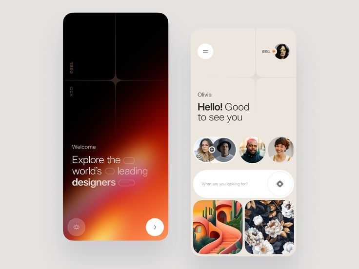

**O que foi observado**

- dois estados lado a lado: onboarding imersivo escuro e home clara orientada à descoberta;
- grid modular com quatro quadrantes superiores e uma junção orgânica em forma de estrela;
- título editorial alinhado à esquerda, com mistura de pesos dentro da mesma frase;
- avatares circulares sobrepostos; busca pill; galeria inferior com cantos muito arredondados;
- ações circulares nos cantos inferiores, uma translúcida e outra branca;
- gradiente quente preto → vermelho → laranja como ponto focal do onboarding.

**Paleta medida da imagem inteira:** `#E2DFDD` 49,3%, `#EDE7E0` 13,7%, `#0B0303` 13,1%, `#D8603A` 6,7%, `#C7AB9E` 5,1%, `#5D1C14` 4,6%, `#856057` 4,5%, `#FDFDFC` 3,0%.

**Tipografia e composição**

- grotesca neo-humanista, semelhante a SF Pro/Helvetica Neue/Inter;
- display estimado 28–34 px no viewport do mockup, peso 300–500;
- corpo e microcopy 11–14 px;
- margens internas estimadas em 20–24 px; gaps de 12–16 px;
- raio externo ~28–32 px; raio dos cards ~18–24 px; controles circulares 44–48 px.

**OCR recuperado:** “Olivia”, “Hello! Good to see you”, “Welcome”, “Explore the world’s leading designers”, “What are you looking for?”.

**Extração para o sistema:** layout modular, busca pill, avatar stack, galeria assimétrica, onboarding com acento quente e uso de peso tipográfico para hierarquia.

**Risco:** texto fino sobre área vermelha/laranja pode perder contraste; o grid ornamental não pode reduzir a área útil de toque.

### 02 — Onboarding narrativo em ambiente escuro

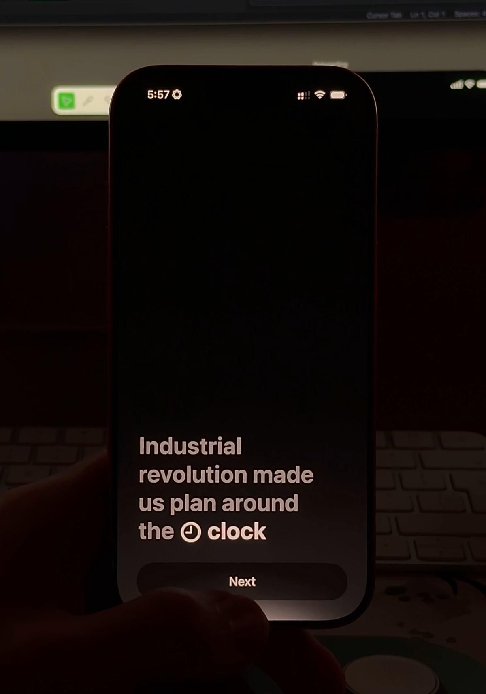

**O que foi observado**

- fotografia real de um iPhone; a UI visível é quase monocromática;
- enorme espaço negativo acima do texto, construindo ritmo e expectativa;
- frase em quatro linhas, peso forte, com ícone de relógio substituindo parte da palavra;
- botão primário escuro, full-width e pill, próximo à safe area inferior;
- status bar branca e ausência de elementos secundários concorrentes.

**Paleta medida:** `#030202` 33,8%, `#0C0302` 30,5%, `#160C09` 12,9%, `#1E1714` 12,1%, `#564D3E` 5,4%, `#3C332A` 3,0%, `#756559` 1,8%, `#C2BD99` 0,5%.

**OCR:** “Industrial revolution made us plan around the clock”, “Next”.

**Extração para o sistema:** onboarding de uma mensagem por página, narrativa curta, botão ancorado, símbolo inline na tipografia.

**Risco:** a captura é fotográfica e quente; tons marrons não são tokens confiáveis da UI. Um botão preto sobre fundo quase preto precisa de borda ou contraste de superfície.

### 03 — Onboarding de produto com autenticação múltipla

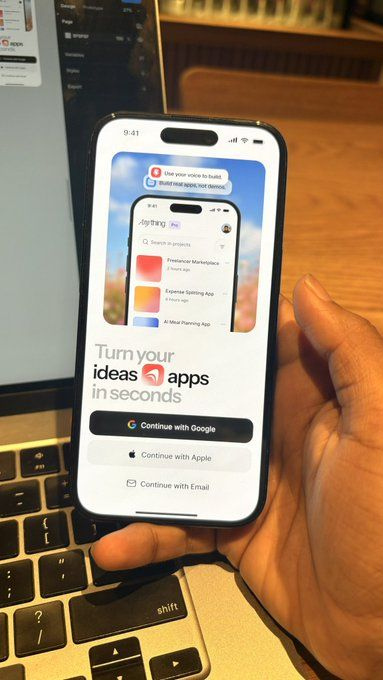

**O que foi observado**

- tela clara com prévia do produto em um card hero arredondado;
- headline “Turn your ideas [into] apps in seconds”, usando variação de peso e possível animação no termo central;
- três provedores de autenticação empilhados: Google em botão escuro, Apple e e-mail em botões claros;
- hierarquia rígida: hero → valor → ação principal → alternativas;
- espaçamento compacto na metade inferior.

**Paleta medida:** `#2E251A` 23,7%, `#834F24` 17,4%, `#C77834` 16,0%, `#F7F6EF` 15,5%, `#9BA5A3` 12,1%, `#F0C067` 6,1%, `#CCD1D4` 5,8%, `#716F65` 3,4%. A maior parte dos marrons pertence à fotografia ambiente, não à UI.

**OCR:** “Turn your ideas apps in seconds”, “Continue with Google”, “Continue with Apple”, “Continue with Email”.

**Extração para o sistema:** autenticação por prioridade, botão com marca do provedor, hero de demonstração e copy curta de transformação.

**Risco:** nomes e ícones de provedores devem seguir as regras oficiais de marca; não reduzir alvos abaixo de 44 px.

### 04 — Boas-vindas cinematográficas / Luminar

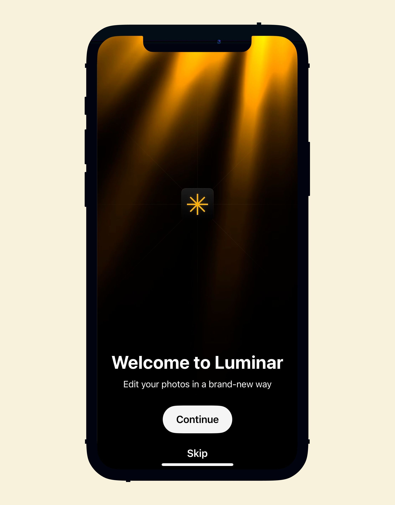

**O que foi observado**

- grande composição de iPhone sobre fundo creme editorial;
- tela interna preta com arte abstrata dourada ocupando o terço superior;
- ícone da marca em tile escuro flutuante;
- título e subtítulo centralizados; CTA branco pill; ação “Skip” como texto;
- hierarquia vertical clássica de onboarding premium.

**Paleta medida:** `#F8F3DC` 49,2%, `#040303` 31,3%, `#2B1907` 9,6%, `#7F4B04` 3,8%, `#ED9F06` 2,4%, `#A2A19B` 1,8%, `#3B3A36` 1,1%, `#706F6D` 1,0%.

**OCR:** “Welcome to Luminar”, “Edit your photos in a brand-new way”, “Continue”, “Skip”.

**Extração para o sistema:** tela de marca escura com arte procedural, sequência logo → título → subtítulo → CTA → escape.

**Risco:** a arte abstrata deve ser exportada responsivamente e não virar o LCP sem otimização; “Skip” precisa continuar sendo um alvo de toque claro.

### 05 — Contador/progresso com glow verde

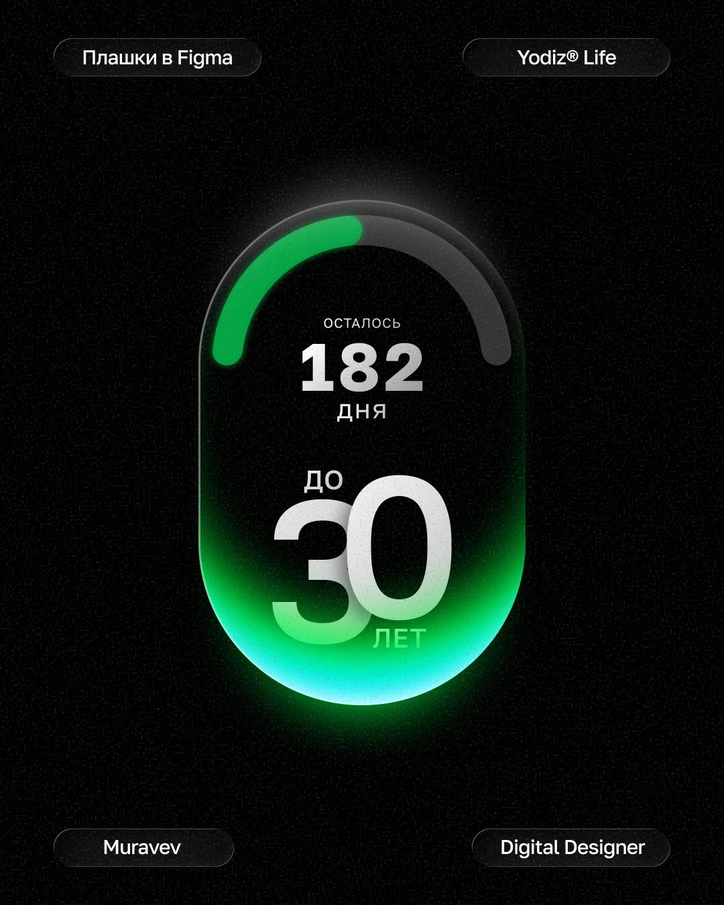

**O que foi observado**

- poster escuro com ruído/grão aplicado à composição inteira;
- cápsulas de metadados nos quatro cantos;
- componente central vertical, entre gauge e cápsula de progresso;
- arco verde com trilha cinza, valor principal “182” e número “30” sobreposto em escala extrema;
- glow verde/ciano concentrado na base do componente.

**Paleta medida:** `#040404` 81,2%, `#101E13` 6,9%, `#3F4140` 3,2%, `#11BC5B` 2,2%, `#6F7F75` 1,9%, `#096B24` 1,6%, `#32EBC6` 1,6%, `#CEDAD2` 1,4%.

**OCR:** “Плашки в Figma”, “Yodiz® Life”, “ОСТАЛОСЬ”, “182”, “Muravev”, “Digital Designer”.

**Extração para o sistema:** gauge de progresso, numeral tabular, cápsula de estado e glow estritamente semântico.

**Risco:** o grande “30” colide visualmente com “182”; ruído reduz legibilidade; verde sobre preto funciona como estado, mas não deve ser o único indicador.

### 06 — Card operacional azul sobre workspace de IA

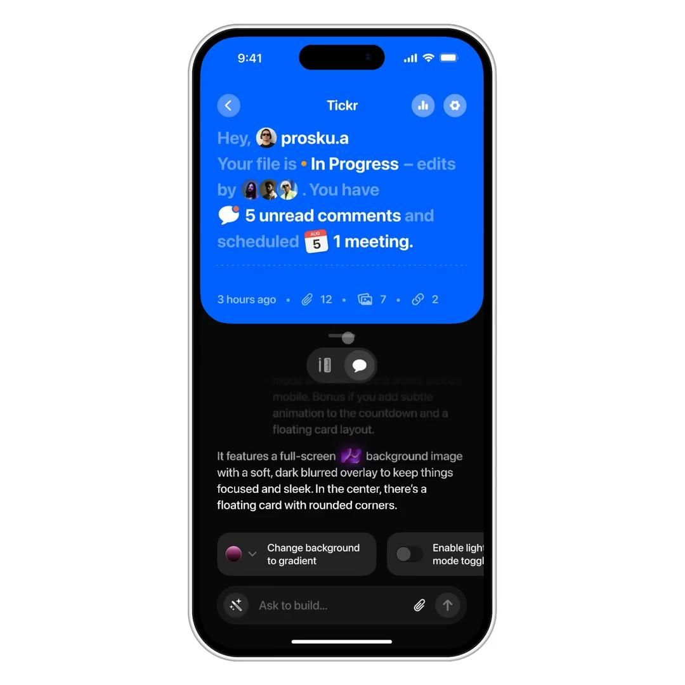

**O que foi observado**

- iPhone isolado sobre branco; interface interna predominantemente preta;
- grande card azul saturado no topo, com saudação, avatares inline, emojis/ícones e métricas;
- texto dentro do card alterna branco e azul claro para indicar prioridade;
- abaixo, conteúdo conversacional em branco e controles de configuração em cards grafite;
- composer inferior com ícone de IA, placeholder, anexo e envio;
- pequeno segmented control flutuante entre card e conversa.

**Paleta medida:** `#FFFFFF` 57,8%, `#0B65F6` 15,4%, `#070707` 10,3%, `#141415` 6,7%, `#BBC7D6` 3,3%, `#24252A` 3,1%, `#353C4C` 2,2%, `#60626F` 1,3%.

**OCR principal:** “Tickr”, “Your file is In Progress”, “5 unread comments”, “1 meeting”, “It features a full-screen background image with a soft, dark blurred overlay”, “Change background to gradient”, “Enable light mode”, “Ask to build…”.

**Extração para o sistema:** card de atividade, conteúdo rico inline, composer persistente, chips de configuração e avatar stack.

**Risco:** a quantidade de estilos inline cria ruído; texto azul-claro sobre azul precisa de verificação; emojis não substituem rótulos acessíveis.

### 07 — Dashboard financeiro com alerta de IA

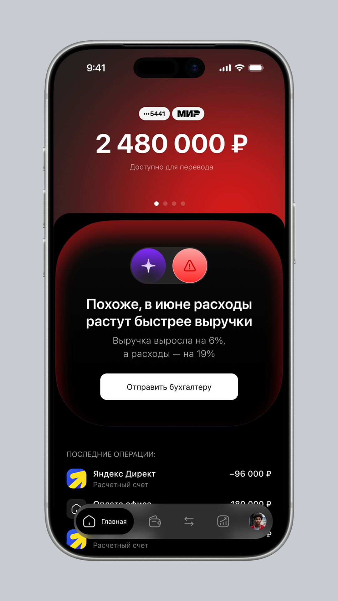

**O que foi observado**

- saldo enorme centralizado sobre gradiente vermelho escuro → vermelho vivo;
- identificadores de conta em chips brancos;
- card de alerta preto, profundo e arredondado, com halo vermelho interno;
- toggle semântico entre brilho roxo e alerta coral;
- CTA branco de alto contraste;
- lista de transações e bottom navigation flutuante translúcida.

**Paleta medida:** `#C8CAD1` 39,1% (fundo externo), `#060404` 27,7%, `#301F1F` 11,9%, `#691B1A` 7,0%, `#B31F1F` 5,3%, `#998684` 4,6%, `#514952` 3,5%, `#FAFAFA` 1,0%.

**OCR traduzido/resumido:** saldo “2 480 000 ₽”, “Disponível para transferência”, alerta de que as despesas de junho crescem mais rápido que a receita, CTA “Enviar ao contador”, “Últimas operações”, “Página inicial”.

**Extração para o sistema:** dado financeiro como hero, insight explicável, alerta com CTA, transações e navegação de cinco destinos.

**Risco:** vermelho não pode significar simultaneamente marca, fundo decorativo e erro; valores financeiros exigem `tabular-nums`, leitura por VoiceOver e sinal além da cor.

### 08 — Timeline de compromissos e exames

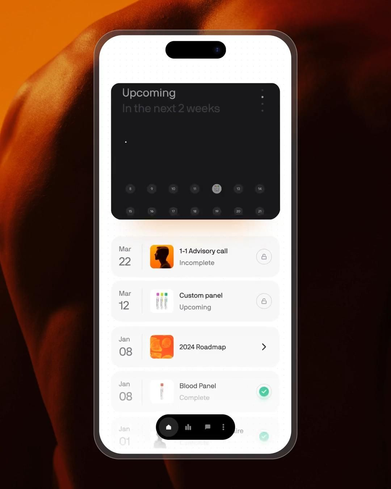

**O que foi observado**

- iPhone branco sobre fotografia laranja/preta;
- card superior grafite com título “Upcoming”, período e calendário em miniatura;
- lista de compromissos em cards brancos, cada um com coluna de data, thumbnail, título, status e ação;
- estados distintos: incompleto/bloqueado, futuro, navegável e completo;
- bottom navigation preta em formato pill, com quatro ícones.

**Paleta medida:** `#170604` 42,2% (fotografia externa), `#FAFAF9` 23,6%, `#1F1C1D` 13,1%, `#CD5F0C` 7,6%, `#651806` 6,2%, `#615A57` 2,6%, `#DAD5CE` 2,4%, `#AAA8A4` 2,2%.

**OCR:** “Upcoming”, “In the next 2 weeks”, “1-1 Advisory call”, “Incomplete”, “Custom panel”, “Upcoming”, “2024 Roadmap”, “Blood Panel”, “Complete”.

**Extração para o sistema:** lista temporal com coluna de data, status por ícone + texto, mini calendário e navegação compacta.

**Risco:** cinza claro sobre branco nos itens concluídos pode falhar WCAG; lock/check precisam de rótulos e não apenas cor.

### 09 — Onboarding de fitness por carrossel

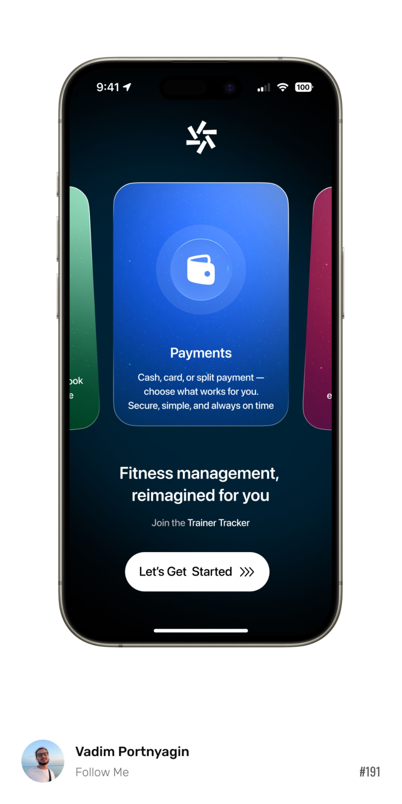

**O que foi observado**

- fundo azul-marinho quase preto;
- carrossel horizontal com card azul central e cards verde/magenta aparecendo nas laterais;
- card hero contém ícone, halos concêntricos, título e descrição centralizada;
- headline abaixo do carrossel em duas linhas, com variação de peso;
- CTA branco extragrande, pill, com três setas indicando avanço;
- grande uso de espaço negativo e composição centrada.

**Paleta medida:** `#FEFEFE` 47,9% (inclui a área editorial inferior), `#030C11` 17,9%, `#0C2A3A` 13,3%, `#1953AE` 6,4%, `#407DF0` 5,3%, `#899996` 3,8%, `#643C54` 3,0%, `#CFD4D5` 2,3%.

**OCR:** “Payments”, “Cash, card, or split payment — choose what works for you. Secure, simple, and always on time”, “Fitness management, reimagined for you”, “Join the Trainer Tracker”, “Let’s Get Started”.

**Extração para o sistema:** carrossel com peek, iconografia central, headline editorial e CTA explícito.

**Risco:** carrossel precisa de indicador, swipe e botões alternativos; setas repetidas não podem ser a única pista de ação.

### 10 — Invite UI em exposição quase branca

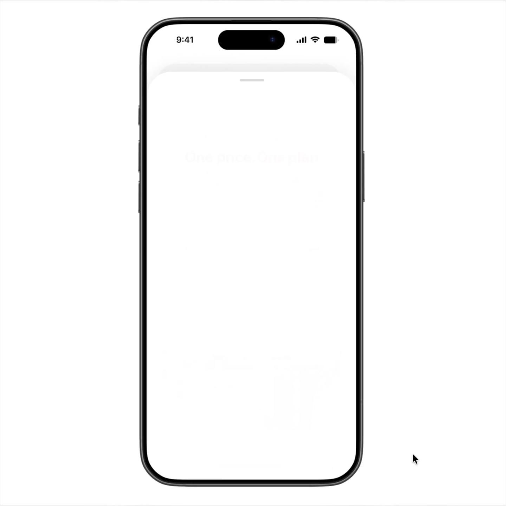

**O que foi observado**

- mockup de iPhone sobre fundo branco;
- bottom sheet ou modal branco com handle superior;
- conteúdo interno foi publicado com exposição tão alta que quase todos os pixels úteis viraram branco;
- somente status bar, moldura, handle e contornos muito fracos permanecem verificáveis.

**Paleta medida:** `#FFFFFF` 91,3%, `#3D3D3D` 2,3%, `#F5F5F5` 1,9%, `#949494` 1,8%, `#727272` 0,9%, `#E2E2E2` 0,7%, `#BEBEBE` 0,7%, `#020203` 0,4%.

**OCR confiável:** somente “9:41”. Tentativas de amplificar a diferença tonal não recuperaram texto ou componentes com confiança suficiente.

**Extração para o sistema:** apenas a ideia de sheet claro sobre shell iOS; não usar esta referência para cores, copy ou arquitetura interna.

**Risco crítico:** contraste praticamente nulo. Esta imagem é evidência de um anti-padrão, não uma tela implementável.

### 11 — Wellness orientado por sinais

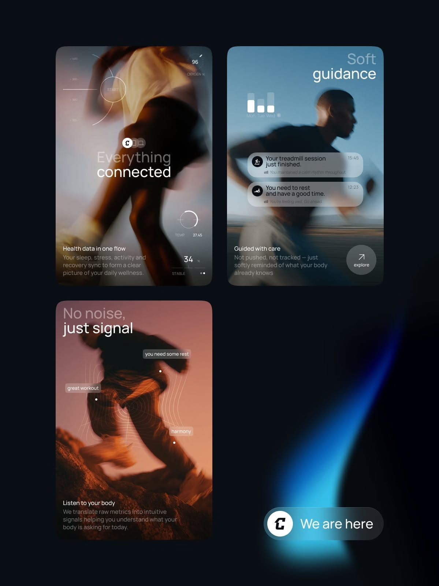

**O que foi observado**

- três telas editoriais sobre fundo preto e um glow azul periférico;
- fotografia de movimento com motion blur e scrim escuro;
- métricas desenhadas como círculos, arcos, barras, linhas e rótulos finos;
- notificações translúcidas sobre fotografia;
- tipografia de alto contraste com palavras-chave em branco e palavras secundárias em cinza;
- CTA circular “explore” e chips contextuais flutuando sobre um mapa corporal.

**Paleta medida:** `#0A0F15` 48,5%, `#040409` 10,2%, `#79625C` 9,1%, `#3C261C` 8,6%, `#334351` 6,7%, `#498CAE` 5,9%, `#9FABB2` 5,6%, `#B4846F` 5,5%.

**OCR principal:** “Everything connected”, “Health data in one flow”, “Soft guidance”, “Your treadmill session just finished”, “You need to rest”, “No noise, just signal”, “Listen to your body”, “We are here”.

**Extração para o sistema:** foto imersiva com dashboard leve, alertas contextuais, copy empática e visualização de dados não invasiva.

**Risco:** corpo fino sobre fotografia falha facilmente; blur de imagem deve ser pré-processado, não animado em tempo real; dados de saúde exigem rótulo textual e contexto.

### 12 — Carteira digital com gradiente ciano

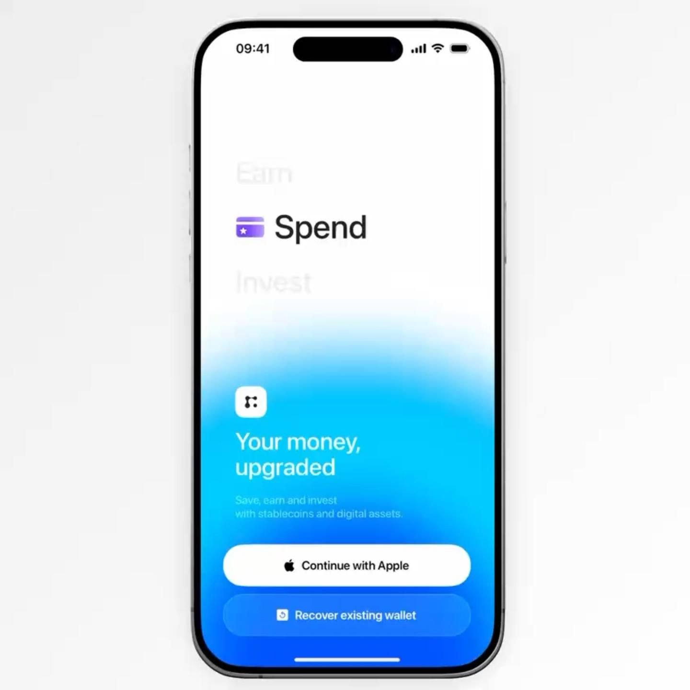

**O que foi observado**

- shell branco com seletor vertical de seções; item ativo “Spend” em preto e ícone roxo;
- metade inferior tomada por gradiente ciano → azul;
- pequeno tile branco da marca, headline “Your money, upgraded” e descrição;
- CTA branco “Continue with Apple” e ação secundária translúcida;
- composição deliberadamente espaçosa, com muita luz.

**Paleta medida:** `#F2F3F4` 40,4%, `#FCFCFC` 34,7%, `#0AC3FC` 7,9%, `#0D71F6` 5,1%, `#BBBCBE` 3,9%, `#72CCF8` 3,8%, `#1B252A` 3,2%, `#5D7985` 0,9%.

**OCR:** “Spend”, “Invest”, “Your money, upgraded”, “Save, earn and invest with stablecoins and digital assets”, “Continue with Apple”, “Recover existing wallet”.

**Extração para o sistema:** navegação contextual tipográfica, hero ciano, autenticação Apple e recuperação secundária.

**Risco:** branco sobre ciano medido tem contraste baixo (~2,05:1); usar texto escuro ou escurecer a base do gradiente.

### 13 — Reuniões com fotografia humana e glass

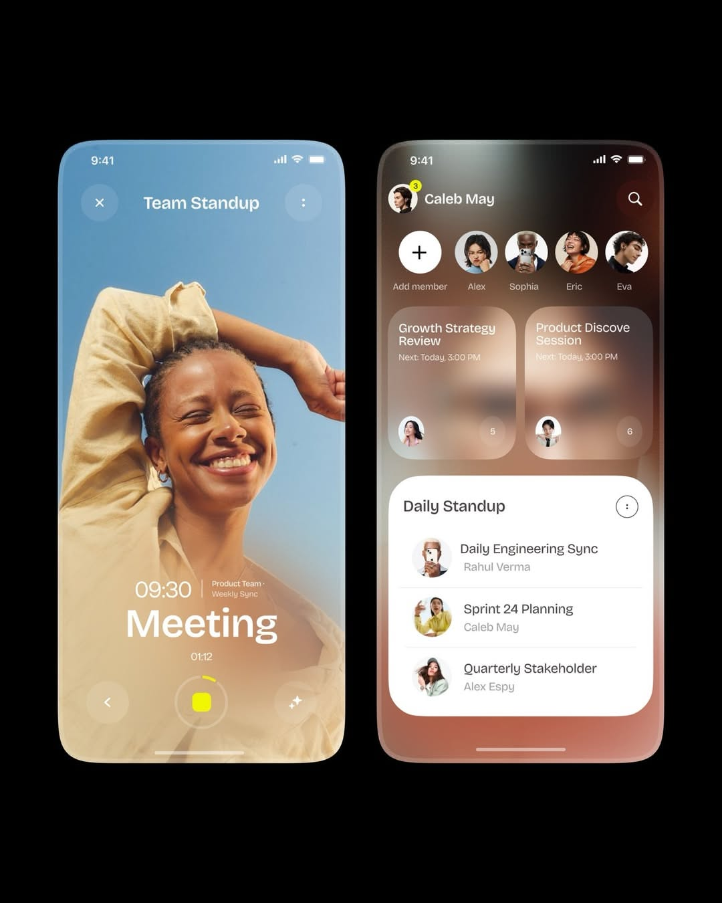

**O que foi observado**

- duas telas sobre fundo preto;
- primeira: videochamada full-bleed, título superior, duração e controle principal amarelo;
- segunda: home com fundo fotográfico desfocado, avatar row, cards de reunião translúcidos e sheet branco de agenda;
- contraste entre material fluido no topo e material sólido na lista;
- avatares abundantes tornam participantes reconhecíveis rapidamente.

**Paleta medida:** `#010101` 44,3%, `#D8BF9B` 11,8%, `#B58B70` 10,2%, `#FBFAF9` 8,6%, `#845D4A` 7,0%, `#3A2D28` 6,3%, `#A6BCC7` 6,0%, `#70A0BF` 5,9%.

**OCR:** “Team Standup”, “Caleb May”, “Add member”, nomes dos membros, “Growth Strategy Review”, “Product Discovery Session”, “Daily Standup”, “Daily Engineering Sync”, “Sprint 24 Planning”, “Quarterly Stakeholder”, “Meeting”.

**Extração para o sistema:** experiência de chamada, cards de reunião, agenda em sheet, avatar row e scrim fotográfico.

**Risco:** controles sobre vídeo precisam de contraste dinâmico; não depender apenas do amarelo para indicar gravação/encerramento; blur deve ter fallback sólido.

### 14 — Hub de IA, chat e voz

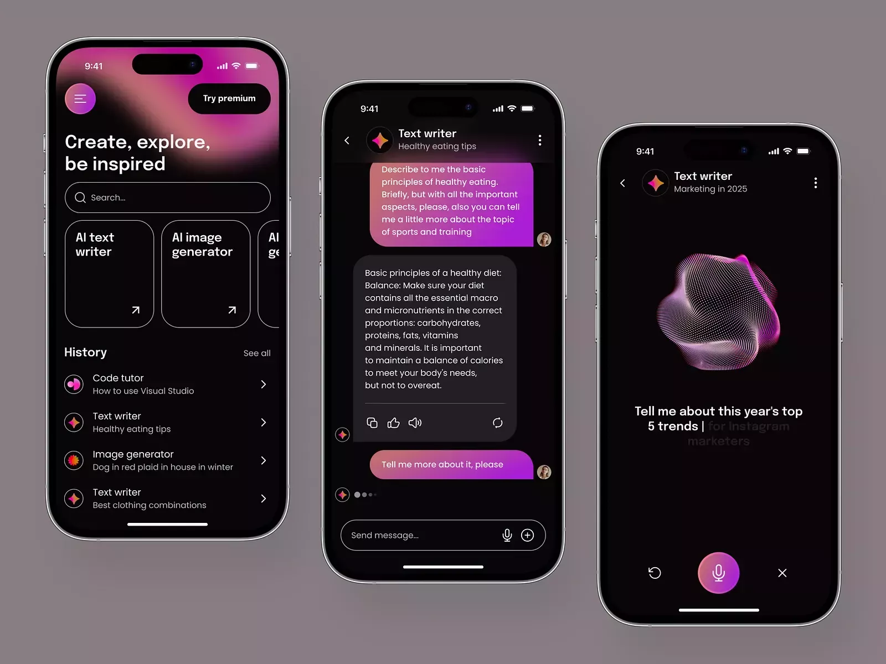

**O que foi observado**

- três telas dark com acento magenta/rosa;
- home com header gradiente, busca, cards de capacidades e histórico;
- chat com bolhas do usuário em gradiente magenta, resposta grafite e ações de copiar/avaliar/ouvir/regenerar;
- modo de voz com forma de partículas, transcrição central e botão de microfone destacado;
- outline branco fino em cards e input; ícones lineares consistentes.

**Paleta medida:** `#847B81` 40,3% (fundo externo), `#0A0509` 24,3%, `#040103` 8,5%, `#191419` 8,1%, `#2B232A` 7,5%, `#B7529F` 4,4%, `#453942` 4,3%, `#6F4A62` 2,6%.

**OCR principal:** “Create, explore, be inspired”, “AI text writer”, “AI image generator”, “History”, “Text writer”, “Send message…”, “Tell me about this year’s top 5 trends”, “Try premium”.

**Extração para o sistema:** hub de capacidades, chat estruturado, ações sobre resposta, estado digitando e modo de voz.

**Risco:** gradiente magenta não deve virar acento global concorrente; texto longo em bolha precisa de largura e line-height adequados; microfone exige estado gravando perceptível por texto, cor e animação reduzível.

### 15 — Assistente por voz com orb azul

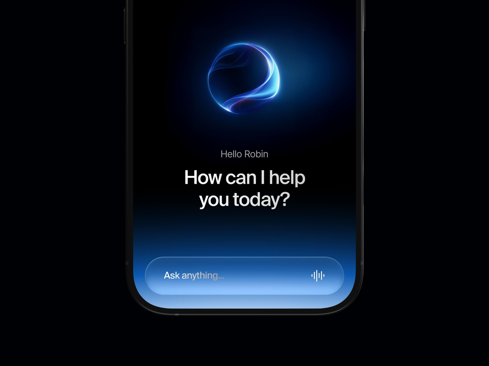

**O que foi observado**

- tela quase preta com gradiente azul subindo pela base;
- orb tridimensional azul no terço superior, com halo luminoso;
- saudação pequena e pergunta principal grande, centralizadas;
- composer de voz extragrande, translúcido, com outline e waveform;
- extrema redução de elementos para sustentar foco conversacional.

**Paleta medida:** `#000205` 70,3%, `#020A1A` 9,3%, `#031A3A` 5,2%, `#77ABE2` 3,8%, `#093161` 3,6%, `#1C1C1E` 3,5%, `#245EA0` 3,2%, `#686B6E` 1,2%.

**OCR:** “Hello Robin”, “How can I help you today?”, “Ask anything…”.

**Extração para o sistema:** modo focus de IA, orb de estado, prompt principal e composer de voz.

**Risco:** orb e glow não podem ser o único feedback de escuta; oferecer transcrição, cancelar, pausar e apagar; animar apenas `transform`/`opacity`, com modo reduced-motion.

## 6. Fundações consolidadas

### 6.1 Princípios de produto visual

1. **White mode sem exceção de tema.** Canvas e superfícies estruturais permanecem brancos/near-white; cores escuras servem a texto, ícone e marca, não a outro tema.
2. **Uma intenção, vários módulos.** Uma tarefa ou decisão domina a tela; cards menores organizam contexto sem competir com ela.
3. **Croma vivo é hierarquia.** Laranja = marca/ação/Premium; verde = crescimento/sucesso; azul = informação/foco/voz; vermelho = risco; roxo = IA. Amarelo fica fora do sistema vigente.
4. **Tempo é conteúdo, não decoração.** Datas, duração, progresso, participantes e contagens permanecem textuais e escaneáveis.
5. **Cards são brancos, acentos são vivos.** Categoria aparece em rail, ícone, badge, borda ou bloco focal; não preencher o dashboard com cards pastel.
6. **Material segue contexto.** Superfície sólida para leitura; glass branco somente sobre mídia ou Progressive Gradient Blur, navegação pequena ou sheet.
7. **Profundidade sem excesso.** Raio, contraste de superfície e uma sombra curta vencem glow, ruído e blur.
8. **Gestos aceleram; controles concluem.** Swipe, drag e voz nunca são o único caminho para uma ação.
9. **IA permanece revisável.** Origem, transformação, estado e resultado aparecem próximos; criação em lote pede confirmação.
10. **Nativo primeiro.** Safe areas, status bar, teclado, foco e alvos de toque seguem convenções de plataforma.

### 6.2 Paleta oficial e extensão digital viva

#### Cores-mãe oficiais

Estes quatro valores são transcrição direta de `Cores Fluvos.pdf`; não devem ser “corrigidos” pelos pixels dos PNGs, que apresentam pequenas variações de perfil/rasterização.

| Token | Valor | Papel oficial | Uso no produto white-only |
|---|---:|---|---|
| `brand-heritage-orange` | `#BD6D3B` | Calor, energia e assinatura institucional. | Logo oficial, editorial e referência histórica; não usar como body text. |
| `brand-pine` | `#213638` | Crescimento, estabilidade e contraste. | Logo padrão sobre branco, heading/ícone de marca e detalhes institucionais. |
| `brand-ink` | `#0D1F22` | Base escura oficial. | Texto principal, ícone e logo funcional sobre branco. |
| `brand-cream` | `#F8F0E4` | Luz e contraste quente. | Logo sobre fundos aprovados e superfícies editoriais pequenas; nunca canvas dominante do app. |

#### Neutros do white mode

| Token | Valor | Uso |
|---|---:|---|
| `white` | `#FFFFFF` | Canvas e superfície principal. |
| `neutral-50` | `#FAFBFA` | Região alternada quase branca. |
| `neutral-100` | `#F4F7F6` | Superfície baixa, skeleton e agrupamento. |
| `neutral-200` | `#E8EEEC` | Hover/selected discreto e trilha. |
| `neutral-300` | `#DCE4E2` | Borda e divisor. |
| `neutral-400` | `#A9B8B5` | Borda forte e controle desabilitado. |
| `neutral-500` | `#758587` | Placeholder/disabled somente após teste de contraste e tamanho. |
| `neutral-600` | `#5A6E70` | Ícone/metadado de ênfase intermediária. |
| `neutral-700` | `#42585A` | Texto secundário. |
| `neutral-800` | `#2B4244` | Texto/ícone forte secundário. |
| `neutral-900` | `#213638` | Pine institucional. |
| `neutral-950` | `#0D1F22` | Texto e ícone principais; igual ao brand ink. |

#### Escala vivid orange — extensão digital

| Token | Valor | Uso |
|---|---:|---|
| `orange-50` | `#FFF4ED` | Estado muito suave/local, nunca identidade principal. |
| `orange-100` | `#FFE4D5` | Fundo de badge/alerta local. |
| `orange-200` | `#FFC4A5` | Borda/track leve. |
| `orange-300` | `#FF9A68` | Ilustração e chart. |
| `orange-400` | `#FF7137` | Hover gráfico e gradiente. |
| `orange-500` | `#FF5A1F` | Vivid brand, rail, ícone, Progressive Gradient Blur e bloco focal com texto ink. |
| `orange-600` | `#D43F00` | Ação primária com texto branco; AA 4,66:1. |
| `orange-700` | `#C63B00` | Hover/pressed com texto branco. |
| `orange-800` | `#8F2A0B` | Texto/status de alta ênfase sobre superfície clara. |
| `orange-900` | `#73260F` | Contraste máximo dentro da família. |

#### Escala vivid green — extensão digital

| Token | Valor | Uso |
|---|---:|---|
| `green-50` | `#EDFFF6` | Estado muito suave/local. |
| `green-100` | `#D2FFE8` | Fundo de badge local. |
| `green-200` | `#9BFFD0` | Borda/track leve. |
| `green-300` | `#55F3AA` | Chart e gradiente. |
| `green-400` | `#20DF86` | Progresso vivo. |
| `green-500` | `#00C975` | Crescimento/sucesso vivid com texto ink. |
| `green-600` | `#00A861` | Hover gráfico e progresso forte. |
| `green-700` | `#087E4C` | Ação de sucesso com texto branco; AA 5,12:1. |
| `green-800` | `#0C633F` | Texto/status de sucesso. |
| `green-900` | `#0D5136` | Contraste máximo dentro da família. |

#### Cores funcionais de apoio

| Token | Valor | Uso |
|---|---:|---|
| `blue-600` | `#0162FB` | Informação, link, foco e seleção utilitária herdada das referências. |
| `blue-700` | `#0054D6` | Hover/pressed informativo. |
| `cyan-500` | `#00C2FF` | Voz e visualização informativa contextual; aparece apenas na variante progressive-information. |
| `purple-600` | `#7A3FF2` | IA e transformação assistida com branco. |
| `red-600` | `#D92D20` | Erro/exclusão com branco. |
| `warning-700` | `#8F2A0B` | Aviso pela família orange, com contraste sobre branco. |
| `premium-500` | `#FF7137` | Premium/coroa alinhado à energia viva da marca, com texto ink. |

As escalas 50–200 são tints funcionais, não a estética dominante. O default de card continua branco; 400–600 aparecem em áreas focais, rails, ícones, gráficos e gradientes.

```css
:root {
  --brand-heritage-orange: #bd6d3b;
  --brand-pine: #213638;
  --brand-ink: #0d1f22;
  --brand-cream: #f8f0e4;

  --white: #ffffff;
  --neutral-50: #fafbfa;
  --neutral-100: #f4f7f6;
  --neutral-200: #e8eeec;
  --neutral-300: #dce4e2;
  --neutral-400: #a9b8b5;
  --neutral-500: #758587;
  --neutral-600: #5a6e70;
  --neutral-700: #42585a;
  --neutral-800: #2b4244;
  --neutral-900: #213638;
  --neutral-950: #0d1f22;

  --orange-50: #fff4ed;
  --orange-100: #ffe4d5;
  --orange-200: #ffc4a5;
  --orange-300: #ff9a68;
  --orange-400: #ff7137;
  --orange-500: #ff5a1f;
  --orange-600: #d43f00;
  --orange-700: #c63b00;
  --orange-800: #8f2a0b;
  --orange-900: #73260f;

  --green-50: #edfff6;
  --green-100: #d2ffe8;
  --green-200: #9bffd0;
  --green-300: #55f3aa;
  --green-400: #20df86;
  --green-500: #00c975;
  --green-600: #00a861;
  --green-700: #087e4c;
  --green-800: #0c633f;
  --green-900: #0d5136;

  --blue-600: #0162fb;
  --blue-700: #0054d6;
  --cyan-500: #00c2ff;
  --purple-600: #7a3ff2;
  --red-600: #d92d20;
  --warning-700: #8f2a0b;
  --premium-500: #ff7137;
}
```

### 6.3 Tokens semânticos

```css
:root {
  color-scheme: light;
  --surface-canvas: #ffffff;
  --surface-primary: #ffffff;
  --surface-secondary: #f4f7f6;
  --surface-elevated: #ffffff;
  --surface-glass: rgb(255 255 255 / 0.84);
  --surface-scrim: rgb(13 31 34 / 0.56);

  --text-primary: #0d1f22;
  --text-secondary: #42585a;
  --text-tertiary: #758587;
  --text-inverse: #ffffff;

  --border-subtle: #dce4e2;
  --border-strong: #a9b8b5;
  --focus-ring: #0162fb;

  --interactive-primary: #d43f00;
  --interactive-primary-hover: #c63b00;
  --interactive-primary-pressed: #c63b00;
  --interactive-primary-text: #ffffff;

  --interactive-success: #087e4c;
  --interactive-success-hover: #0c633f;
  --interactive-success-text: #ffffff;

  --accent-brand-vivid: #ff5a1f;
  --accent-growth-vivid: #00c975;
  --status-success: #087e4c;
  --status-info: #0162fb;
  --status-warning: #8f2a0b;
  --status-danger: #d92d20;
  --status-ai: #7a3ff2;
  --status-premium: #ff7137;
}
```

**Contrato white-only:** não criar seletor de tema escuro por atributo, theme provider, toggle, persistência de tema ou override automático por `prefers-color-scheme`. `brand-ink` e `brand-pine` continuam permitidos como texto/logo; isso não constitui dark mode.

### 6.4 Contraste medido para combinações críticas

| Primeiro plano / fundo | Contraste | Decisão |
|---|---:|---|
| `#0D1F22` / `#FFFFFF` | 16,99:1 | AAA; texto principal e logo ink. |
| `#213638` / `#FFFFFF` | 12,73:1 | AAA; logo/texto pine. |
| `#42585A` / `#FFFFFF` | ≥ 7:1 | Texto secundário de alto contraste. |
| `#BD6D3B` / `#FFFFFF` | 3,88:1 | Logo/ícone ou texto grande; não body text. |
| `#F8F0E4` / `#213638` | 11,26:1 | Logo cream em pine aprovado; não cria tema de app. |
| `#0D1F22` / `#FF5A1F` | 5,45:1 | AA; texto ink sobre vivid orange. |
| `#FFFFFF` / `#D43F00` | 4,66:1 | AA; botão orange primary. |
| `#FFFFFF` / `#C63B00` | 5,22:1 | AA; hover/pressed orange. |
| `#0D1F22` / `#00C975` | 7,78:1 | AAA; texto ink sobre vivid green. |
| `#FFFFFF` / `#087E4C` | 5,12:1 | AA; ação de sucesso. |
| `#FFFFFF` / `#0162FB` | 5,07:1 | AA para texto normal; CTA principal. |
| `#FFFFFF` / `#D92D20` | 4,83:1 | AA; destruição sólida. |
| `#FFFFFF` / `#7A3FF2` | 5,50:1 | AA; ação de IA sólida. |
| `#0D1F22` / `#FF7137` | Verificar no componente | Premium usa `brand-ink`; nunca depende apenas da cor ou da coroa. |

Logotipos são isentos do critério WCAG de texto, mas o sistema busca ao menos 3:1 para legibilidade. Contraste de token não substitui teste no componente final, incluindo hover, disabled, gradiente, fotografia e high-contrast mode.

### 6.5 Gradientes

**Diretriz vigente:** os antigos gradientes diagonais, freeform e mesh multicoloridos deixam de ser a linguagem oficial. A referência Fuse analisada em 2026-08-16 estabelece o **Progressive Gradient Blur**: campo cromático vertical monohue + blur gaussiano progressivo controlado por máscara.

#### Anatomia obrigatória

1. o canvas começa em branco puro e preserva entre 42% e 58% da altura sem croma dominante;
2. uma camada cromática vertical entra de forma longa e difusa: névoa transitória → vivid → tom profundo da mesma família;
3. um pseudo-elemento replica essa camada, recebe blur entre 32 e 72 px e é revelado por `mask-image` vertical;
4. OKLab/OKLCH evita banding perceptual e transições acinzentadas;
5. conteúdo fica em uma camada separada acima do material; texto e controles nunca recebem blur;
6. orange e green são variantes independentes. Misturá-los no mesmo campo produziria amarelo/marrom intermediário e viola a disciplina cromática solicitada.

| Token | Sequência | Uso |
|---|---|---|
| `progressive-orange` | white → orange mist → `orange-400` → `orange-500` → Heritage Orange | Marca, onboarding, hero de ação e Premium. |
| `progressive-green` | white → green mist → `green-400` → `green-500` → `green-700` | Crescimento, Moments, conclusão e conquista. |
| `progressive-information` | white → cyan mist → `cyan-500` → `information-500` | Voz e processamento; uso contextual, nunca o app inteiro. |
| `progressive-mask` | transparent 0% → 24% alpha em 22% → black em 58–100% | Controla onde a camada desfocada se torna visível. |
| `progressive-blur` | `clamp(32px, 6vw, 72px)` | Difusão responsiva do pseudo-elemento duplicado. |

```css
.progressive-gradient-blur {
  position: relative;
  isolation: isolate;
  overflow: hidden;
  background: #fff;
}

.progressive-gradient-blur__chromatic,
.progressive-gradient-blur::after {
  position: absolute;
  inset: 32% -12% -18%;
  background: linear-gradient(
    to bottom in oklab,
    transparent 0%,
    oklch(0.91 0.08 50 / 0.36) 18%,
    oklch(0.76 0.18 55) 46%,
    oklch(0.70 0.22 43) 72%,
    #bd6d3b 100%
  );
  pointer-events: none;
}

.progressive-gradient-blur::after {
  content: "";
  filter: blur(clamp(32px, 6vw, 72px));
  mask-image: linear-gradient(to bottom, transparent, rgb(0 0 0 / 0.24) 22%, #000 58%);
}
```

#### Não confundir com

- **mesh/freeform:** possui vários centros ou pontos de cor em duas dimensões; está descontinuado no sistema vigente;
- **aurora:** depende de faixas ondulantes luminosas;
- **glassmorphism:** é uma superfície translúcida sobre um fundo, não o campo cromático;
- **linear gradient simples:** não contém camada duplicada, blur variável nem máscara progressiva;
- **backdrop blur uniforme:** desfoca com força constante e não produz a progressão observada.

Referências técnicas primárias: [Apple `CIMaskedVariableBlur`](https://developer.apple.com/documentation/coreimage/cifilter/3228355-maskedvariableblur), [Apple `CISmoothLinearGradient`](https://developer.apple.com/documentation/coreimage/cifilter/3228407-smoothlineargradient), [MDN `mask-image`](https://developer.mozilla.org/en-US/docs/Web/CSS/Reference/Properties/mask-image), [MDN `blur()`](https://developer.mozilla.org/en-US/docs/Web/CSS/Reference/Values/filter-function/blur) e [W3C CSS Color 4](https://www.w3.org/TR/css-color-4/).

Listas, formulários e agenda permanecem brancos. O material é reservado a hero, onboarding, Moments, campanhas e outros blocos focais; reduced motion elimina qualquer drift opcional, e forced colors remove a camada decorativa.

### 6.6 Tipografia vigente

**Família única:** **42dot Sans via Google Fonts** para títulos, corpo, botões, dados e controles. O PDF histórico chama a família de “42dot Serif” e recomenda PT Serif para títulos; a diretriz de produto mais recente substitui ambas as orientações no runtime. A hierarquia passa a ser construída por tamanho, peso, linha, largura e espaço — nunca por uma serif.

| Token | Família | Tamanho / linha | Peso | Uso |
|---|---|---:|---:|---|
| `display-hero` | 42dot Sans | `clamp(3rem, 8cqi, 5.5rem)` / 0,96–1,00 | 700–800 | Headline institucional/hero. |
| `display` | 42dot Sans | `clamp(2.5rem, 6cqi, 4rem)` / 1,00 | 700–800 | Onboarding e marco de marca. |
| `heading-1` | 42dot Sans | `clamp(2rem, 5cqi, 3rem)` / 1,08 | 700 | Título de página. |
| `heading-2` | 42dot Sans | `clamp(1.5rem, 3.5cqi, 2rem)` / 1,15 | 700 | Seção editorial. |
| `heading-3` | 42dot Sans | 20 px / 26 px | 700 | Card, dialog e seção densa. |
| `body-lg` | 42dot Sans | 18 px / 28 px | 400–500 | Intro e onboarding. |
| `body` | 42dot Sans | 16 px / 24 px | 400 | Texto padrão. |
| `body-sm` | 42dot Sans | 14 px / 20 px | 400–500 | Metadados e listas. |
| `label` | 42dot Sans | 14 px / 18 px | 600–700 | Botões, chips e tabs. |
| `caption` | 42dot Sans | 12 px / 16 px | 500 | Status e timestamp. |
| `data` | 42dot Sans | conforme componente | 500–700 | Datas, horas, métricas e progresso tabular. |

```css
@import url("https://fonts.googleapis.com/css2?family=42dot+Sans:wght@300;400;500;600;700;800&display=swap");

:root {
  --font-display: "42dot Sans", system-ui, -apple-system, "Segoe UI", sans-serif;
  --font-sans: "42dot Sans", system-ui, -apple-system, "Segoe UI", sans-serif;
}
```

**Regras tipográficas**

- títulos: `text-wrap: balance`; parágrafos: `text-wrap: pretty`;
- nenhuma fonte serif é usada no produto, no catálogo ou em peças geradas por este sistema;
- 42dot Sans Light não é usada para corpo operacional; mínimo 400 e, sobre mídia, 500;
- valores financeiros, datas e progresso: `font-variant-numeric: tabular-nums`;
- não ajustar tracking sem prova; usar métricas naturais da fonte;
- largura de leitura: 45–72 caracteres; chat até ~56 caracteres por linha;
- mínimo de 16 px em inputs para impedir zoom involuntário no iOS;
- carregar apenas os pesos usados via Google Fonts CSS2 e manter fallback sans-serif para reduzir deslocamento;
- o lettering do logo é sempre imagem/master, nunca texto ao vivo.

### 6.7 Espaçamento

Grade base de **4 px**, com escala semântica:

| Token | Valor | Uso típico |
|---|---:|---|
| `space-0` | 0 | Reset. |
| `space-1` | 4 px | Ícone + badge, ajuste óptico. |
| `space-2` | 8 px | Elementos intimamente relacionados. |
| `space-3` | 12 px | Gap de controles/chips. |
| `space-4` | 16 px | Padding de card compacto. |
| `space-5` | 20 px | Padding móvel padrão. |
| `space-6` | 24 px | Margem de página e card confortável. |
| `space-8` | 32 px | Separação de grupos. |
| `space-10` | 40 px | Seção curta. |
| `space-12` | 48 px | Ritmo de onboarding. |
| `space-16` | 64 px | Bloco editorial/hero. |
| `space-20` | 80 px | Espaço negativo controlado. |

Espaçamento fluido de seção: `clamp(2rem, 1.4rem + 3vw, 5rem)`.

### 6.8 Raios, bordas e forma

| Token | Valor | Uso |
|---|---:|---|
| `radius-xs` | 8 px | Badge e mini tile. |
| `radius-sm` | 12 px | Input compacto, thumbnail. |
| `radius-md` | 16 px | Lista/card utilitário. |
| `radius-lg` | 20 px | Card principal. |
| `radius-xl` | 24 px | Sheet e painel. |
| `radius-2xl` | 32 px | Hero card/glass card. |
| `radius-pill` | 999 px | Botão, navegação e chip. |

- borda sutil: 1 px; borda de seleção/focus: 2 px;
- evitar múltiplos raios arbitrários dentro da mesma superfície;
- cards aninhados: raio interno = raio externo − padding visual;
- ícones circulares: 44–48 px; CTA circular expressivo: 56–64 px.

### 6.9 Elevação e materiais

| Token | Definição | Uso |
|---|---|---|
| `shadow-1` | `0 1px 2px rgb(13 31 34 / 0.08)` | Separação mínima. |
| `shadow-2` | `0 8px 24px rgb(13 31 34 / 0.12)` | Card flutuante. |
| `shadow-3` | `0 20px 60px rgb(13 31 34 / 0.18)` | Modal/sheet sobre mídia. |
| `glass-default` | `rgb(255 255 255 / 0.84)` + blur estático 16 px | Navegação pequena sobre Progressive Gradient Blur/mídia. |
| `glass-dense` | `rgb(255 255 255 / 0.94)` + blur estático 10 px | Sheet/card com texto sobre fundo variável. |
| `glass-border` | `rgb(255 255 255 / 0.76)` | Contorno de glass sobre material cromático progressivo. |
| `scrim-photo` | `linear-gradient(180deg, transparent 20%, rgb(13 31 34 / 0.78) 100%)` | Proteção local de texto sobre fotografia. |

Glass continua sendo **branco translúcido**, não um segundo tema. Glows são componentes semânticos, não elevação padrão. Limites: superfície pequena, sem loop, sem blur animado > 8 px.

### 6.10 Iconografia e imagens

- ícones lineares, cantos arredondados, grid de 20 ou 24 px, stroke visual ~1,75–2 px;
- estados ativos podem usar ícone sólido dentro de círculo/pill;
- ícone sem texto sempre recebe nome acessível;
- thumbnails: 1:1; galeria editorial: 4:5 ou 3:4; hero: 16:10/16:9; full-screen: respeitar `object-position`;
- avatares: 32, 40, 48 e 64 px; stack com overlap de 20–28%; borda da superfície de 2 px;
- o destino **Perfil** da navegação móvel exibe a foto da conta (`user_metadata.avatar_url` ou `user_metadata.picture`) em recorte circular; iniciais aparecem somente quando o provedor não entrega imagem ou a imagem falha;
- fotografia: humana, movimento real, temperatura quente/fria coerente com o modo; evitar stock genérico;
- arte abstrata/orb: exportar como imagem otimizada ou shader controlado, com fallback estático e alt adequado.
- marca: consumir somente os masters em [`brand-assets/`](./brand-assets/), sem `filter`, máscara, recoloração, redesenho ou composição tipográfica do lettering;
- usar SVG apenas quando um master vetorial oficial for fornecido; não autovetorizar os PNGs e apresentá-los como originais;
- todo raster de marca declara `width` e `height`; logo no header pode ser eager, usos abaixo da dobra são lazy.

## 7. Arquitetura de componentes

### 7.1 Shell de tela móvel

- largura de referência: 375, 390 e 430 CSS px;
- padding inline padrão: 20 px; telas densas: 16 px; editoriais: 24 px;
- padding superior = `max(16px, env(safe-area-inset-top))`;
- padding inferior em controles fixos = `max(16px, env(safe-area-inset-bottom))`;
- altura mínima usa `100dvh`, nunca `100vh` isolado;
- conteúdo rolável não pode terminar escondido pela bottom navigation.

### 7.2 App header

**Variantes:** `minimal`, `title`, `profile`, `immersive`.

- altura útil 48–56 px além da safe area;
- ação esquerda, título e ações direitas em alvos mínimos de 44×44 px;
- `immersive` usa scrim e ícones brancos sobre mídia;
- títulos longos truncam em uma linha; nomes de tela nunca ficam dependentes apenas de ícone.

### 7.3 Botões

| Variante | Superfície | Texto | Altura | Raio | Uso |
|---|---|---|---:|---:|---|
| `primary` | `interactive-primary` | branco | 52 px | pill | Ação principal. |
| `primary-on-vivid` | branco | `brand-ink` | 52–56 px | pill | CTA sobre bloco Progressive Gradient Blur com contraste medido. |
| `success` | `interactive-success` | branco | 52 px | pill | Confirmar/concluir com semântica de sucesso. |
| `info` | `status-info` | branco | 52 px | pill | Fluxo informativo ou autorização contextual. |
| `secondary` | `surface-secondary` | primário | 48–52 px | pill | Ação alternativa. |
| `outline` | transparente + borda | primário | 48–52 px | pill | Baixa ênfase. |
| `ghost` | transparente | primário | 44 px | 12 px | Toolbar e lista. |
| `icon` | sólido ou glass | ícone | 44–48 px | circular | Ação compacta. |
| `voice` | azul primário | branco | 56–64 px | circular | Gravação e IA por voz. |

Estados obrigatórios: default, hover quando houver ponteiro, pressed, focus-visible, loading, disabled e error. Feedback de interação ≤ 200 ms. Loading mantém a largura e inclui rótulo acessível.

### 7.4 Campos, busca e composer

- altura 52–56 px; padding inline 16–20 px; raio pill ou 16 px;
- busca: ícone inicial, placeholder e limpar; não usar somente placeholder como label;
- composer de chat: input expansível até 5–7 linhas, anexo e envio em alvos independentes;
- composer de voz: waveform decorativa `aria-hidden`, estado textual “Ouvindo”, “Processando”, “Pausado”;
- erro aparece junto ao campo com texto, ícone e `aria-describedby`;
- nunca bloquear colar.

### 7.5 Cards

**Content card**

- superfície branca sólida; padding 16–24 px; raio 16–24 px;
- título, descrição, metadado e ação têm ordem constante;
- ideal para lista, compromisso, histórico e resposta de IA.

**Glass card**

- permitido sobre imagem/gradiente com fallback opaco;
- `background` de 64–82% de opacidade, blur estático 12–16 px, borda branca de 10–20%;
- texto precisa passar contraste após composição real.

**Feature card**

- aspect-ratio 4:5 ou 3:4; ícone/arte → título → descrição;
- superfície base branca; cor viva entra por rail, ícone, borda, arte ou um bloco focal deliberado;
- pode compor carrossel; card vizinho aparece 10–18% para sugerir swipe.

**Alert/insight card**

- ícone + severidade textual + título + explicação + CTA;
- cor semântica é acento, não superfície inteira por padrão;
- dados usados na explicação devem ser legíveis por leitor de tela.

### 7.6 Carrossel de recursos

- snap por item; scroll horizontal nativo; peek controlado;
- indicador de posição textual ou dots com `aria-label`;
- botões anterior/próximo quando houver teclado ou desktop;
- não autoavançar; se autoavanço for requisito futuro, oferecer pausa;
- cards inativos podem reduzir escala/opacidade, nunca legibilidade do item ativo.

### 7.7 Timeline/lista de eventos

- colunas: data fixa 52–64 px, mídia 40–48 px, conteúdo flexível, ação 44 px;
- status inclui texto e ícone; não usar apenas cor;
- separador por agrupamento, não entre cada linha quando o card já cria contorno;
- datas usam `time` semântico e numerais tabulares;
- itens finalizados não recebem opacidade tão baixa que inviabilize leitura.

### 7.8 Navegação inferior flutuante

- 4–5 destinos, altura visual compacta de 52–60 px, margem lateral 16–24 px e alvos internos de 44 px;
- fundo sólido ou glass pequeno; raio pill;
- o app móvel não mostra rótulos visuais: cada ícone mantém `aria-label` e o destino atual usa `aria-current="page"`;
- existe **exatamente um** item orange por vez: o destino atual usa orange vivo; ao abrir a creation sheet, `Criar` assume o estado orange e o destino anterior volta ao neutro;
- `Criar` é neutro enquanto fechado; não há segundo orange pastel/opaco concorrendo com o destino ativo;
- `Perfil` usa a foto da conta Apple/Google; borda/fallback preservam leitura em 30 px;
- alvos ≥ 44×44 px; respeitar safe area;
- não sobrepor o último item rolável: reservar `padding-block-end`.

### 7.9 Avatar row e stack

- row com nome sob/ao lado quando identidade importa;
- stack limitado a 4–5 avatares + contador “+N”;
- fotos têm alt com nome quando informativas; `alt=""` quando o nome já estiver adjacente;
- estado online usa ponto + texto acessível, não cor isolada.

### 7.10 Sheet/modal

- sheet móvel com raio superior 24–32 px e handle 36×4 px;
- título visível, fechar acessível, foco inicial previsível e retorno de foco;
- usar `<dialog>`/primitive acessível, não construir focus trap manual;
- conteúdo não deve repetir entrada já fornecida;
- ação destrutiva usa AlertDialog dedicado.

### 7.11 Chat de IA

- usuário: bolha/acento moderado; assistente: superfície neutra;
- largura máxima 88% no mobile e 640 px em telas amplas;
- ações de resposta: copiar, avaliar, ouvir, regenerar, cada uma com tooltip/nome acessível;
- estado de geração oferece parar; erros permanecem próximos à mensagem;
- conteúdo rico mantém hierarquia de headings, listas e código;
- não sugerir que a IA está consciente; copy clara sobre processamento e limites.

### 7.12 Assistente por voz / orb

- estados: `idle`, `listening`, `processing`, `speaking`, `paused`, `error`;
- cada estado possui texto, ícone e movimento opcional;
- orb é visualização, não controle primário oculto;
- controles explícitos: iniciar/parar, cancelar, teclado, replay;
- transcrição ao vivo com `aria-live="polite"`, evitando anúncio caractere a caractere;
- reduced motion troca pulsação por mudança estática de cor/borda.

### 7.13 Gauge e visualização de dados

- valor numérico e unidade sempre visíveis;
- arco serve como reforço; incluir percentual/descrição textual;
- escala precisa de mínimo/máximo e significado;
- mudanças positivas/negativas usam seta/label além da cor;
- gráfico não deve misturar numeral decorativo e operacional sem hierarquia clara.

### 7.14 Estados vazios, loading e erro

- vazio: título, explicação curta e uma ação clara;
- loading: skeleton estrutural com dimensões reservadas, sem shimmer contínuo em reduced motion;
- erro: contextual, recuperável e com ação concreta; não somente toast;
- offline: preservar trabalho local quando houver entrada do usuário e indicar sincronização pendente;
- sucesso: confirmação discreta e persistência do resultado no conteúdo.

### 7.15 Date strip e calendário diário

- `DateStrip` contém controle do mês, dias roláveis e seleção única; cada dia expõe nome, número e estado por texto/semântica;
- largura do item: 72–88 px; altura 104–120 px; gap 8–12 px; selecionado usa preenchimento + peso + `aria-current="date"`;
- `TimeGrid` usa rail de horário de 52–64 px, slots configuráveis de 30/60 minutos e linhas fora da árvore de acessibilidade;
- `CalendarEventCard` recebe `start`, `end`, `title`, `category`, `participants`, `channel`, `status` e `conflict`;
- conflito não sobrepõe texto: divide coluna, empilha com contador ou abre visão detalhada;
- timezone e localização precisam ser explícitos quando o evento não usa a zona local.

### 7.16 Task/event card

- ordem: tile/categoria → título + flag/status → descrição curta → local/tempo/pessoas → ação;
- padding 16–20 px, raio 20–24 px, gap vertical 8–12 px, sombra `shadow-1` ou `shadow-2` somente quando flutua;
- rail colorido de 3–4 px é redundante ao rótulo de categoria;
- metadados truncáveis mostram valor integral em detalhe/tooltip; título crítico quebra até duas linhas;
- edição, concluir, adiar, entrar em chamada e abrir detalhe são ações nomeadas; ícone isolado nunca é o único contexto;
- estados: `scheduled`, `in-progress`, `done`, `snoozed`, `overdue`, `cancelled`, `generated`.

### 7.17 Course/progress card

- cabeçalho com avatar stack opcional, título, total de unidades/duração e thumbnail 1:1 de 88–112 px;
- barra segmentada representa unidades somente quando a quantidade é inteligível; acima de 24, usar barra contínua;
- texto “X de Y” ou “N restantes” é obrigatório e usa `<progress>` quando aplicável;
- segmentos completos/incompletos não dependem apenas de azul/cinza; fornecer nome/valor programático;
- thumbnail tem `aspect-ratio`, `width`/`height`, lazy loading abaixo da dobra e fallback neutro.

### 7.18 Segmented controls, tabs e metadata chips

- seleção que troca conteúdo usa tabs reais (`tablist`, `tab`, `tabpanel`); filtro de lista usa grupo de botões/checkbox conforme cardinalidade;
- altura 44–48 px; item ativo combina superfície, texto e opcionalmente ícone; teclado segue Arrow/Home/End em tabs;
- `MetadataChip` tracejado significa campo ainda não preenchido; preenchido recebe superfície sólida e botão de limpar separado;
- chips informativos não recebem `role="button"`; chips acionáveis têm verbo/nome acessível;
- badges de AI/Premium/status ficam entre 20–28 px de altura e não reduzem o target do controle hospedeiro.

### 7.19 Creation sheet e captura por voz

- `CreationSheet` compartilha um único modelo de dados entre Task/List/Voice para não perder entrada ao trocar de modo;
- no mobile ocupa até `min(88dvh, conteúdo)`; no desktop vira dialog 480–640 px; CTA sticky não cobre campos;
- campos: título obrigatório, descrição opcional, inbox/lista, data, responsável, label, prioridade, lembrete e repetição;
- estado do microfone inclui permissão, input level decorativo, idioma, pausa, cancelar, transcrição e confirmar;
- voz nunca envia/cria automaticamente sem revisão quando a transcrição alterar dados importantes;
- fechar com mudanças abre confirmação de descarte; erro aparece junto ao campo/controle responsável.

### 7.20 Gestos, Moments e exclusão

- `SwipeDeck` aceita drag por ponteiro/toque, mas oferece dois botões equivalentes e atalhos de teclado documentados;
- limiar de conclusão não excede 35% da largura e mostra feedback antes de executar; cancelamento retorna por transform;
- `SwipeRevealRow` expõe ação destrutiva, mas foco por teclado alcança um botão “Excluir” sem exigir gesto;
- item removido vai para lixeira/undo temporário; remoção irreversível usa AlertDialog com nome do item;
- `MomentsProgress` anuncia “etapa X de Y”; cota comercial é separada do progresso da sessão;
- card deck mantém apenas 2–3 cards montados visualmente; conteúdo fora do topo não entra indevidamente na ordem de foco.

### 7.21 List row, favoritos e Premium

- `CategoryRow`: tile 48–56 px, nome, descrição de uma linha, contadores e favorito/disclosure; row mínimo 88–104 px;
- favorito é toggle com `aria-pressed`; contador de links/tarefas possui label explícito;
- `PlanSelector` é radio group com plano, preço total, equivalente periódico e economia comprovável;
- paywall inclui CTA de compra, restaurar compra, termos, privacidade, fechar e estado de processamento/erro;
- benefícios usam ícone + título + explicação; chevron somente se houver navegação real;
- Premium orange/coroa não modifica a prioridade de tarefas nem substitui rótulo textual.

### 7.22 Reunião, resumo e ações de IA

- `MeetingDetail` exibe fonte, horário, timezone, membros, canal/link e permissões antes de conteúdo derivado;
- `SummaryTabs` alterna fonte integral, pontos e resumo sem descartar posição/estado do usuário;
- ações Transcript/Clean up/Rephrase/Action items são comandos com verbo, estado e escopo; não são tags decorativas;
- geração mostra `idle`, `queued`, `generating`, `review`, `applied`, `error` e permite cancelar quando possível;
- checklist gerado mantém item selecionável/editável; “Gerar tarefas” abre revisão e pede confirmação da lista/datas;
- output de IA distingue texto-fonte, inferência e mudança aplicada; erros preservam o resultado parcial seguro.

### 7.23 Matriz mínima de estados dos componentes prioritários

| Componente | Estados obrigatórios além do default |
|---|---|
| Date strip | today, selected, has-events, disabled, loading |
| Task/event card | pressed, focus, done, snoozed, overdue, conflict, error |
| Progress card | empty, partial, complete, loading, unavailable |
| Creation sheet | pristine, dirty, validating, submitting, success, error |
| Voice capture | permission, listening, paused, processing, review, error |
| Swipe/drag | grabbed, threshold, cancel, committed, undo |
| Premium plan | selected, purchasing, purchased, restore, error |
| AI action | queued, generating, review, applied, cancelled, error |

### 7.24 BrandMark e lockups

`BrandMark` centraliza a escolha dos 16 masters oficiais e impede variações improvisadas.

| Propriedade | Valores | Contrato |
|---|---|---|
| `family` | `symbol-framed`, `symbol-open`, `lockup-stacked`, `lockup-horizontal` | Seleciona a família pela função e espaço disponível. |
| `tone` | `pine`, `ink`/`black`, `orange`, `cream` | Deve existir como arquivo oficial na matriz 2.4; não aplicar cor via CSS. |
| `purpose` | `navigation`, `identity`, `editorial`, `decorative` | Define tamanho, carregamento e texto alternativo. |
| `priority` | boolean | `true` apenas quando a marca participa do primeiro viewport/LCP. |

- `navigation`: símbolo framed pine/ink em 32–40 px, dentro de link “FluvOS” para a home;
- `identity`: lockup horizontal em espaços largos e stacked em composição compacta; respeitar fundo e tamanho mínimo da seção 2.5;
- `editorial`: orange ou cream somente nas combinações oficiais aprovadas;
- `decorative`: `alt=""` e fora da árvore acessível; se for a única identificação da marca, `alt="FluvOS"`;
- o componente renderiza `` com dimensões intrínsecas, `object-fit: contain` e caminho explícito do catálogo 2.4;
- nenhum estado hover/pressed distorce, gira, recorta, troca cor ou anima o desenho interno; a interação acontece no contêiner;
- não construir o lettering com texto ao vivo e não misturar símbolo de uma família com lettering de outra.

## 8. Responsividade

### 8.1 Estratégia

- mobile-first e breakpoints ditados pelo conteúdo;
- componentes usam container queries quando podem aparecer em regiões de larguras diferentes;
- tipografia e espaço usam `clamp()` com limites, nunca `vw` sem limite;
- imagens usam `picture`, `srcset` e art direction quando o corte muda;
- propriedades lógicas (`padding-inline`, `margin-block`) habilitam RTL e localização.

### 8.2 Comportamento por largura

| Faixa de conteúdo | Regras |
|---|---|
| `< 360 px` | Padding 16 px; ações secundárias podem ir para menu; cards ocupam uma coluna; títulos reduzem até o mínimo do token. |
| `360–479 px` | Padrão móvel: padding 20 px; date strip/carrossel rolável; bottom nav flutuante; sheets inferiores. |
| `480–767 px` | Padding 24 px; utilitários em duas colunas quando cada card mantiver ≥ 220 px; agenda ainda é coluna única. |
| `768–1023 px` | Agenda + painel de detalhe opcional; bottom nav vira rail; sheet vira dialog; lista pode ocupar 5/7 colunas. |
| `≥ 1024 px` | Shell máximo 1200–1280 px; grid de 12 colunas; calendário semanal, painel de detalhe e rail lateral; leitura limitada a 640–720 px. |

### 8.3 Transformações de componentes

- timeline: lista no mobile → rail de horas + painel de detalhe no tablet → semana multicoluna no desktop;
- date strip: scroll/snap no mobile → semana completa fixa no tablet/desktop;
- dashboard P01: hero full-width + grid 2 colunas no mobile → hero 7 colunas e utilitários 5 colunas no desktop;
- task/event card: metadados empilham no mobile → uma linha flexível no desktop, sem comprimir título;
- course card: thumbnail 88–112 px no mobile → 128–160 px em região ampla; progresso permanece abaixo do texto;
- carrossel: swipe no mobile → grid de 3 cards no desktop;
- bottom nav: pill inferior → navigation rail/sidebar em viewport amplo;
- sheet: bottom sheet no mobile → dialog central com largura 480–640 px;
- Moments: deck central de no máximo 430 px; em desktop, contexto/lixeira ocupam painel lateral, nunca um card gigantesco;
- Premium: sheet quase full-height no mobile → modal 720–880 px ou página em duas colunas; preços continuam num único radio group;
- meeting detail: página empilhada no mobile → fonte à esquerda e resumo/ações à direita; CTA de geração não cobre checklist;
- chat: bolhas quase full-width → coluna central; painel contextual opcional à direita;
- hero fotográfico: corte 4:5 no mobile → 16:9 ou split layout no desktop;
- avatar row: scroll horizontal no mobile → wrap controlado no desktop.

### 8.4 Regras de estabilidade

- todos os `img`, vídeos e embeds declaram `width`/`height` ou `aspect-ratio`;
- usar `min-width: 0` em filhos flex/grid com texto;
- truncar somente conteúdo repetível; informação crítica quebra linha;
- zoom a 200% não pode esconder ações ou exigir scroll bidimensional;
- componentes fixos respeitam safe area e teclado virtual.
- o teclado não pode esconder CTA ou campo ativo no creation sheet; usar visual viewport/inset, não altura fixa;
- grid de calendário não cria scroll horizontal obrigatório a 200% de zoom: muda para lista antes disso;
- bottom nav/rail preserva os mesmos destinos e nomes entre breakpoints para manter consistência cognitiva.

## 9. Motion

### 9.1 Vocabulário

| Token | Duração | Uso |
|---|---:|---|
| `motion-instant` | 80 ms | Press visual mínimo. |
| `motion-fast` | 120 ms | Ícone, toggle, hover. |
| `motion-feedback` | 160 ms | Botão, chip, seleção. |
| `motion-standard` | 200 ms | Card/controle local. |
| `motion-enter` | 280 ms | Sheet, mensagem, card. |
| `motion-emphasis` | 400 ms | Transição de onboarding ou orb one-shot. |

- entrada: `ease-out`; saída: `ease-in`; deslocamento: 8–16 px;
- animar apenas `transform` e `opacity` por padrão;
- mudanças de layout usam FLIP/View Transition apenas quando justificadas;
- não animar continuamente `width`, `height`, `top`, `left`, blur, gradiente ou grande fotografia;
- pausar loops fora da viewport; `will-change` somente durante a animação;
- feedback de interação nunca excede 200 ms;
- sistema principal: CSS/tw-animate para microinterações; `motion/react` somente quando interação JS realmente exigir.

### 9.2 Motion por componente

- **carrossel:** spring moderado no snap nativo, sem overshoot exagerado;
- **sheet:** translateY 12–24 px + opacity, 280 ms;
- **mensagem de chat:** translateY 8 px + opacity, 160–200 ms;
- **bottom nav:** indicador ativo move por transform; ícones não pulam;
- **date strip/tabs:** seleção muda superfície sem deslocar texto; indicador usa transform/opacity ≤ 160 ms;
- **task card press:** escala mínima 0,99 ou mudança de superfície ≤ 120 ms; não aplicar bounce em lista densa;
- **drag-to-complete:** card/knob segue o ponteiro por transform; cruzar o limiar muda ícone + texto; commit ≤ 200 ms;
- **swipe reveal:** row desliza por transform e revela uma ação já montada; cancelamento retorna sem animar largura;
- **Moments deck:** card superior pode rotacionar até 4°; próximo card permanece estável; nenhuma física contínua fora do gesto;
- **voice capture:** anéis usam scale/opacity em camada pequena; nível de áudio não controla blur; pausa deixa estado estático;
- **AI generation:** skeleton estrutural ou indicador local; não usar texto “digitando” como prova de consciência;
- **gauge:** preencher uma vez ao entrar; valor textual aparece imediatamente;
- **orb:** escala 0,98–1,02 + opacity/rotação de camada pequena; no máximo 8 px de blur estático;
- **erro:** sem shake obrigatório; preferir borda/ícone/texto estáveis.

### 9.3 Reduced motion

Com `prefers-reduced-motion: reduce`:

- remover auto-play, parallax, motion blur e pulsações;
- drag/swipe continua funcional sem interpolação e mantém os botões equivalentes visíveis;
- voice capture troca anéis pulsantes por borda/ícone/label estáticos;
- confete Premium e rotações do Moments são removidos;
- trocar transições por crossfade ≤ 100 ms ou mudança instantânea;
- manter estado e feedback perceptíveis por texto, cor e borda;
- scroll fica `auto`, não smooth.

## 10. Acessibilidade WCAG 2.2

### 10.1 Requisitos de base

- alvo: WCAG 2.2 AA;
- texto normal ≥ 4,5:1; texto grande ≥ 3:1; componente/focus ≥ 3:1;
- target técnico ≥ 24×24 px; target confortável do sistema ≥ 44×44 px;
- todas as funções disponíveis por teclado; ordem de foco acompanha a visual;
- `:focus-visible` com outline de 2 px e offset de 2 px;
- foco nunca pode ficar totalmente escondido por header/nav fixos;
- skip link em shells web com navegação repetitiva;
- idioma da página e trechos em outro idioma devem ser declarados.

### 10.2 Conteúdo e mídia

- alt descreve função/conteúdo, não estética genérica;
- imagem decorativa usa `alt=""`;
- gráficos complexos incluem resumo textual e tabela/dados acessíveis;
- vídeo possui legendas; áudio possui transcrição; voice UI sempre oferece texto;
- não usar cor, glow, posição ou movimento como único indicador.

### 10.3 Interação

- preferir elementos nativos e primitives Radix/Base UI/React Aria consistentes;
- icon button recebe `aria-label`; SVG interno é `aria-hidden`;
- campos têm `<label>` programático, descrição e erro associado;
- mensagens dinâmicas usam live region apropriada sem excesso;
- autenticação permite paste/autofill e oferece alternativa a testes cognitivos;
- drag/swipe tem alternativa por botão;
- tabs, radio groups e date strips seguem padrões ARIA/APG e roving tabindex quando necessário;
- sheet/dialog prende foco somente enquanto modal, fecha por ação explícita/Escape e devolve foco ao disparador;
- ação destrutiva revela o item e a consequência; remoção irreversível exige confirmação;
- voz oferece texto, edição e estado de permissão; gravação ativa permanece perceptível sem depender de animação;
- tempo limite, se existir, pode ser estendido.

### 10.4 Riscos identificados nas referências

| Risco | Referências | Correção do sistema |
|---|---|---|
| Arrastar para concluir como único controle | P03 | Botão equivalente, teclado e feedback antes do commit (WCAG 2.5.7). |
| Swipe para classificar/excluir | P05, P06 | Ações visíveis/focáveis e confirmação/undo. |
| Pastéis e ciano com texto branco | P01–P04 | Texto `ink-950`; reservar branco para azul `#0162FB`/cores que passem AA. |
| Dots e rails dependentes de cor | P02, P05, P07 | Label, contagem, estado e legenda programática. |
| Sheet/coachmark cobrindo conteúdo/foco | P04, P05, P06 | Primitive acessível, foco gerenciado, Escape, retorno e target não obstruído. |
| Voice pulse sem transcrição | P04 | Estado textual, transcrição editável e alternativa de teclado. |
| Preço/oferta ambíguos | P06 | Total, período, moeda, base do desconto e controles radio semânticos. |
| IA aplicando tarefas sem revisão | P07 | Preview selecionável, origem, confirmação e desfazer. |
| Bottom nav sobre último item | P01, P02, P06, P07 | Safe area + padding final equivalente à altura da barra. |
| Texto branco sobre ciano/verde/coral | 01, 05, 12 | Texto escuro, stop mais escuro ou scrim. |
| Texto fino sobre fotografia | 02, 11, 13 | Scrim ≥ 64%, peso ≥ 450 e contraste medido. |
| Cinza muito claro em lista | 08, 10 | Elevar contraste; não comunicar “concluído” só com opacidade. |
| Glow como estado exclusivo | 05, 15 | Texto + ícone + borda/controle. |
| Carrossel dependente de swipe | 09 | Dots rotulados e botões alternativos. |
| Áudio/IA sem transcrição explícita | 14, 15 | Transcrição e controles textuais. |
| Dados densos decorativos | 06, 07, 11 | Hierarquia semântica, descrição e numerais tabulares. |

## 11. Performance, React/Next.js e Core Web Vitals

### 11.1 Orçamento recomendado

| Recurso | Orçamento inicial |
|---|---:|
| Peso total inicial | < 1,5 MB |
| JavaScript comprimido | < 300 KB |
| CSS comprimido | < 100 KB |
| Imagens above-the-fold | < 500 KB |
| Fontes | < 100 KB |
| Terceiros | < 200 KB |

### 11.2 Imagens e efeitos

- fotografia: AVIF com WebP fallback; PNG apenas para transparência necessária;
- os sete PNGs de referência totalizam ~9,67 MB e são documentação, não assets de produção; não embarcar os mockups no app;
- reconstruir cards, gradientes, progresso e chips em CSS/SVG; exportar apenas ilustrações 3D realmente aprovadas;
- `next/image` com `sizes` realista e dimensões explícitas;
- somente a imagem LCP recebe `priority`/`fetchPriority="high"`; demais usam lazy loading;
- reservar aspect-ratio para hero, avatar, thumbnail de curso, tile de categoria, card e orb;
- avatar stacks carregam somente os tamanhos exibidos; fotos fora do primeiro viewport usam lazy loading;
- pré-renderizar blur/scrim em assets quando possível;
- não animar grandes `filter: blur()` ou `backdrop-filter`;
- orb/partículas pesadas entram por import dinâmico e têm poster estático.

### 11.3 React/Next.js

- Server Components por padrão; tornar client apenas a fronteira interativa;
- iniciar requisições independentes juntas e resolver com `Promise.all`;
- agenda, tarefas, curso e categorias iniciam dados independentes em paralelo; detalhes pesados são buscados ao abrir/prefetch por intenção;
- evitar imports barrel de bibliotecas grandes;
- usar `next/dynamic` para visualização 3D, charts complexos e voice stack;
- adiar analytics e terceiros até depois da hidratação/interação;
- derivar estado durante render em vez de `useEffect` desnecessário;
- componentes caros recebem memoização somente com evidência;
- drag/swipe guarda valores transitórios em refs/motion values, não em estado React por frame;
- voz, confete e arte 3D são carregados somente quando a feature é ativada;
- derivar contagens/progresso durante render; não sincronizar estado derivado por `useEffect`;
- não declarar componentes dentro de componentes;
- listas extensas usam `content-visibility`/virtualização quando necessário;
- listeners de scroll passivos e deduplicados; motion por View Timeline/IntersectionObserver, não polling de `scrollY`.

### 11.4 Metas Core Web Vitals

| Métrica | Meta | Proteção de design |
|---|---:|---|
| LCP | ≤ 2,5 s | Hero no HTML inicial, asset otimizado/preloaded, fonte não bloqueante. |
| INP | ≤ 200 ms | Feedback imediato, handler curto, IA/voz fora da main thread quando possível. |
| CLS | ≤ 0,1 | Dimensões reservadas, skeleton estável, fonte com fallback métrico. |

Proteções específicas das referências prioritárias:

- **LCP:** headline/dashboard e primeiros cards chegam no HTML inicial; ilustração 3D não bloqueia conteúdo; fonte usa `font-display` e fallback métrico;
- **INP:** feedback de drag/swipe aparece antes de persistência/rede; análise de voz/IA sai da main thread; handlers ficam abaixo de 100 ms;
- **CLS:** date strip, thumbnails, avatar stacks, bottom nav, sheets e resultados de IA têm espaço reservado; conteúdo gerado não é injetado acima do foco;
- listas longas de agenda/categorias usam `content-visibility` ou virtualização somente após evidência de volume, preservando navegação/foco;
- blur/backdrop-filter não é animado; fundos 3D de campanha são assets responsivos AVIF/WebP com art direction, não canvas JS por padrão.

Não é possível declarar esses gates “aprovados” a partir de imagens ou deste Markdown; eles só podem ser medidos numa implementação executável e, idealmente, com dados de campo no percentil 75.

## 12. Z-index e camadas

Escala fixa; valores arbitrários são proibidos.

| Token | Valor | Camada |
|---|---:|---|
| `z-base` | 0 | Conteúdo. |
| `z-raised` | 10 | Card elevado/decoração local. |
| `z-sticky` | 20 | Header e controles sticky. |
| `z-nav` | 30 | Navegação fixa. |
| `z-popover` | 40 | Tooltip, menu e popover. |
| `z-scrim` | 50 | Scrim modal. |
| `z-modal` | 60 | Dialog/sheet. |
| `z-toast` | 70 | Notificação global. |

Stacking context de um componente não pode competir com a escala global. Transform/opacity em ancestrais devem ser revisados porque criam novos contexts.

## 13. Conteúdo e tom de voz

As referências favorecem copy curta, direta e humana:

- **headlines:** uma promessa ou pergunta por vez; 3–9 palavras;
- **descrição:** explicar benefício em uma ou duas frases, sem hype;
- **CTA:** verbo + resultado (“Continuar”, “Enviar ao contador”, “Começar”);
- **IA:** linguagem clara sobre o que acontece agora (“Ouvindo”, “Gerando resposta”, “Tentar novamente”);
- **tarefas:** verbo, objeto, tempo e consequência (“Marcar como concluída”, “Adiar para amanhã”, “Mover para a lixeira”);
- **Premium:** preço, periodicidade e benefício verificáveis; sem falsa urgência, economia inventada ou cota confusa;
- **exclusão:** distinguir “Mover para a lixeira” de “Excluir permanentemente”;
- **dados:** explicar causa, período e ação possível; não dramatizar;
- **erro:** dizer o que ocorreu, o que foi preservado e como recuperar;
- **localização:** permitir expansão de 30–40% sem truncar ações críticas.

Não copiar textos, nomes ou marcas mostrados nas referências.

## 14. Tokenização em três camadas

1. **Primitivos:** valores crus (`orange-600`, `green-700`, `blue-600`, `space-4`, `radius-lg`).
2. **Semânticos:** intenção (`interactive-primary`, `surface-elevated`, `status-danger`).
3. **Componente:** contrato local (`button-primary-bg`, `composer-border`, `nav-active-surface`).

Exemplo:

```css
:root {
  --button-primary-bg: var(--interactive-primary);
  --button-primary-fg: var(--interactive-primary-text);
  --button-primary-height: 3.25rem;
  --button-primary-radius: var(--radius-pill);

  --card-bg: var(--surface-primary);
  --card-fg: var(--text-primary);
  --card-border: var(--border-subtle);
  --card-radius: 1.25rem;

  --composer-bg: var(--surface-elevated);
  --composer-fg: var(--text-primary);
  --composer-placeholder: var(--text-tertiary);
  --composer-focus: var(--focus-ring);

  --task-card-bg: var(--surface-primary);
  --task-card-radius: var(--radius-xl);
  --task-card-shadow: var(--shadow-1);
  --task-card-category-rail: var(--accent-brand-vivid);

  --date-selected-bg: var(--interactive-primary);
  --date-selected-fg: var(--interactive-primary-text);
  --date-event-dot: var(--status-ai);

  --bottom-nav-bg: rgb(255 255 255 / 0.88);
  --bottom-nav-active-bg: var(--interactive-primary);
  --bottom-nav-active-fg: var(--interactive-primary-text);
  --bottom-nav-create-idle-bg: var(--surface-secondary);
  --bottom-nav-create-idle-fg: var(--text-primary);
  --bottom-nav-height: 3.25rem;

  --sheet-bg: var(--surface-primary);
  --sheet-radius: var(--radius-2xl);
  --sheet-scrim: var(--surface-scrim);

  --ai-badge-bg: var(--surface-primary);
  --ai-badge-fg: var(--status-ai);
  --ai-badge-border: var(--status-ai);
  --premium-badge: var(--status-premium);
  --danger-surface: var(--surface-primary);
  --danger-fg: var(--status-danger);
  --danger-border: var(--status-danger);
}
```

Mudanças de tokens semânticos ou de componente são mudanças de API e devem receber versionamento e nota de migração.

## 15. Regras “faça / não faça”

### Faça

- mantenha white mode como único tema e escolha uma intenção e um acento vivo principal por tela;
- use canvas/superfícies brancas, texto ink/pine e cor viva em rail, ícone, badge, gráfico ou bloco focal;
- rastreie primeiro a identidade oficial, depois P01–P07 e só então os pins secundários;
- use os 16 masters de logo sem alteração, respeitando combinação, respiro e tamanho mínimo;
- use 42dot Sans em títulos, controles e corpo; construa hierarquia com peso, escala e espaço;
- use espaço negativo para hierarquia;
- preserve safe areas e alvos de 44 px;
- combine ícone, texto e cor em estados;
- use scrim mensurável sobre fotografia;
- mantenha cards sólidos para leitura longa;
- forneça fallback estático para orb, partículas e blur;
- trate dados com numerais tabulares e contexto;
- ofereça botões equivalentes para drag/swipe e revisão para ações de IA;
- use tints 50–200 apenas em estado local e sempre teste texto ink; o card default permanece branco;
- reutilize primitives acessíveis existentes do projeto.

### Não faça

- não misture azul, verde, vermelho e magenta como acentos equivalentes na mesma vista;
- não use fontes serif, nem mesmo como acento editorial;
- não criar dark mode, theme toggle, tokens dark ou adaptação automática a esquema escuro;
- não transformar tints/pastéis em linguagem dominante nem colorir todos os cards;
- não recolorir, filtrar, redesenhar, autovetorizar ou remontar o logotipo;
- não transformar o fundo 3D azul dos mockups em canvas padrão do app;
- não usar EverSync, textos, ilustrações ou preços das referências como conteúdo final;
- não transforme todo card em glass;
- não use glow como affordance principal;
- não anime blur, layout ou grandes imagens continuamente;
- não crie raios, z-index ou espaçamentos arbitrários;
- não use texto fino/cinza sobre fotografia;
- não esconda ações essenciais atrás de swipe, gesto ou ícone sem nome;
- não executar tarefas geradas por IA nem exclusões irreversíveis sem revisão/confirmação;
- não use `h-screen`; use `min-height: 100dvh` e safe area;
- não introduza uma nova biblioteca de primitives ou motion sem necessidade;
- não declare conformidade de acessibilidade/performance sem medição real.

## 16. Gate de qualidade para implementação futura

| Gate | Critério de aprovação | Estado deste documento |
|---|---|---|
| Identidade oficial | Paleta-mãe, tipografia e logo rastreáveis aos materiais oficiais; master sem alteração. | **Coberto como especificação.** |
| White-only | Não existem tokens, provider, toggle ou adaptação dark; superfícies estruturais são brancas. | **Coberto como regra.** |
| Fidelidade visual | Tokens e componentes rastreáveis à identidade e às referências, sem copiar marcas externas. | **Coberto como especificação.** |
| Autoridade | Conflitos resolvidos pela hierarquia da seção 1.2. | **Coberto como regra.** |
| Responsividade | 320 px até desktop, zoom 200%, sem overflow. | **Requer implementação.** |
| Acessibilidade automatizada | axe/Lighthouse sem erros críticos/sérios. | **Requer implementação.** |
| Acessibilidade manual | Teclado, VoiceOver/NVDA/TalkBack, foco, reduced motion. | **Requer implementação.** |
| Contraste | Pares reais passam WCAG 2.2 AA. | **Pares-base medidos; componentes requerem teste.** |
| Performance | Orçamentos respeitados; sem main-thread long task > 50 ms. | **Requer implementação.** |
| LCP | ≤ 2,5 s no p75. | **Requer dados de campo.** |
| INP | ≤ 200 ms no p75. | **Requer dados de campo.** |
| CLS | ≤ 0,1 no p75. | **Requer dados de campo.** |
| SEO | título, descrição, headings, canonical, sitemap e crawlability. | **Fora do alcance das imagens.** |
| Segurança/web | HTTPS, CSP, sem mixed content/console errors. | **Fora do alcance das imagens.** |

## 17. Checklist de handoff para design

- [ ] Confirmar white mode exclusivo, sem variante de tema escuro.
- [ ] Confirmar identidade oficial antes de P01–P07 e P01–P07 antes dos pins.
- [ ] Selecionar o master correto de logo e registrar família, tone, fundo e tamanho.
- [ ] Usar orange/green vivid para energia e crescimento; manter o card default branco.
- [ ] Aplicar 42dot Sans via Google Fonts como única família viva.
- [ ] Definir intenção e ação principal da tela.
- [ ] Usar apenas tokens primitivos → semânticos → componente.
- [ ] Desenhar 320, 375/390, 768 e 1280 px ou provar breakpoints por conteúdo.
- [ ] Incluir default, pressed, focus, disabled, loading, empty e error.
- [ ] Incluir estados específicos da matriz 7.23 para componentes usados.
- [ ] Desenhar alternativa explícita para drag, swipe e voz.
- [ ] Incluir teclado aberto e safe areas.
- [ ] Verificar expansão de localização em 40%.
- [ ] Escrever alt/labels/descrições de gráfico.
- [ ] Especificar reduced motion.
- [ ] Exportar AVIF/WebP e crops responsivos.
- [ ] Medir contraste na composição final, não no token isolado.
- [ ] Registrar quais referências sustentam cada decisão.

## 18. Checklist de handoff para engenharia

- [ ] Não implementar theme provider/toggle/dark tokens; declarar `color-scheme: light`.
- [ ] Consumir `BrandMark`/masters oficiais sem filtro ou recoloração e com dimensões intrínsecas.
- [ ] Carregar 42dot Sans via Google Fonts CSS2 com pesos 300–800, `display=swap` e fallback sans-serif.
- [ ] Usar primitives acessíveis do projeto; não recriar foco/teclado manualmente.
- [ ] Componentes quadrados usam `size-*`; classes condicionais usam `cn`.
- [ ] Evitar valores Tailwind arbitrários quando um token existir.
- [ ] `next/image` com `sizes`, dimensões e prioridade correta.
- [ ] Server Component por padrão; fronteira client mínima.
- [ ] Import dinâmico para arte/voz/chart pesado.
- [ ] Animação somente transform/opacity por padrão.
- [ ] Drag/swipe usa motion value/ref, sem setState por frame, e possui controle equivalente.
- [ ] Tabs, radios, dialog/sheet e AlertDialog usam primitive acessível único e consistente.
- [ ] IA/voz/3D carregam sob demanda; resultados gerados preservam revisão e erro local.
- [ ] `prefers-reduced-motion`, high contrast e 200% zoom testados.
- [ ] Alvos de toque ≥ 44×44 px.
- [ ] Focus ring visível e não obstruído.
- [ ] Erros no ponto de ação; dados digitados preservados.
- [ ] Lighthouse/axe + teste manual + Web Vitals de campo antes de marcar gates.

## 19. Matriz de rastreabilidade

| Padrão consolidado | Referências que sustentam a decisão |
|---|---|
| White mode exclusivo | Diretriz explícita do produto; P01, P02, P04 e P07 como apoio visual |
| Paleta-mãe orange/pine/ink/cream | `Cores Fluvos.pdf` |
| Orange/green vivid como extensão digital | Diretriz explícita do produto, derivada semanticamente da identidade oficial |
| Símbolo, lettering e lockups oficiais | 16 PNGs da pasta `1 - Símbolos` e `Aplicação Fluvos.pdf` |
| 42dot Sans como família única | Diretriz explícita do produto de 2026-08-16; `Fontes.pdf` e TTFs apenas como evidência histórica do nome correto |
| Azul elétrico como informação/foco, não marca primária | P03–P07; P01/P02 como azul informativo |
| Tints semânticos somente locais, com texto escuro | P01, P02, P03, P06, P07; subordinados à diretriz vivid |
| Dashboard modular | P01, P02 |
| Date strip e calendário temporal | P02, P07 |
| Task/event card | P02, P03, P05, P07 |
| Barra segmentada de progresso | P01, P02 |
| Bottom navigation flutuante | P01, P02, P06, P07; pins 07, 08 |
| Avatar row/stack | P01, P02; pins 01, 06, 13 |
| Sheet de criação e voz | P04 |
| Swipe/drag com alternativa | P03, P05, P06 |
| Lixeira recuperável + AlertDialog final | P05, P06 |
| Premium/coroa e plan selector | P03, P05, P06 |
| Reunião, resumo e ações de IA | P07 |
| Card sólido para leitura | P01–P07; pins 06, 07, 08, 14 |
| Glass pontual | P01, P04, P06, P07; pins 11, 13 |
| Fotografia full-bleed + scrim opcional | pins 02, 11, 13 |
| Interfaces dark apenas como evidência externa não adotada | pins 05, 06, 07, 14, 15; anuladas pela diretriz white-only |

## 20. Limitações e decisões honestas

- `Cores Fluvos.pdf` é a autoridade cromática: pequenas diferenças nos pixels dos PNGs são tratadas como efeito de perfil/rasterização, não como novas cores oficiais.
- O manual fornecido não especifica numericamente área de proteção nem tamanho mínimo do logo. Os valores da seção 2.5 são recomendações operacionais identificadas como tal, não regras originais inventadas.
- `Fontes.pdf` escreve “42dot Serif”, mas os seis TTFs entregues identificam a família como **42dot Sans**. O sistema segue os arquivos reais e registra a divergência.
- Não foi fornecido master vetorial do logo; os 16 PNGs foram preservados byte a byte. Um SVG autovetorizado não deve ser apresentado como arquivo oficial.
- Os sete anexos prioritários foram preservados byte a byte a partir dos arquivos temporários fornecidos; não há metadado confiável de autor, fonte, licença ou arquivo Figma, portanto nada disso foi inventado.
- A extração anterior recuperou os 15 arquivos máximos publicados pelo Pinterest, mas “original” significa o máximo disponível no CDN, não necessariamente o arquivo-fonte do autor.
- O pin 10 está praticamente superexposto; inventar seu conteúdo interno seria incorreto. Ele foi preservado e documentado como evidência de baixo contraste.
- As paletas de quadro completo P03–P07 são dominadas pelo fundo editorial ciano/azul. Para os tokens prioritários foram usados recortes das áreas de UI; ainda assim, não se afirma equivalência com tokens originais.
- Fontes, easing, blur, opacidade e breakpoints originais não podem ser extraídos com precisão de pixels estáticos.
- Acessibilidade, motion, responsividade, React, performance e Web Vitals aqui são contratos recomendados. Nenhum gate de runtime pode ser aprovado antes de existir uma interface executável.
- O `designlang` não foi executado sobre o Pinterest porque isso extrairia o design system do site Pinterest, não o das interfaces rasterizadas dentro dos pins. Sua taxonomia de 19 áreas foi usada para estruturar a inspeção.

## 21. Procedência

- identidade oficial: pasta local `Identidade Visual - FluvOS`, incluindo `Cores Fluvos.pdf`, `Fontes.pdf`, `Aplicação Fluvos.pdf`, fontes/licenças e 16 PNGs de marca;
- cores oficiais: transcrição dos quatro hexadecimais impressos em `Cores Fluvos.pdf`; extensão vivid é uma decisão deste design system, não uma quinta cor oficial;
- logotipos: 16 PNGs copiados sem recompressão para [`brand-assets/`](./brand-assets/), com dimensões, bytes e SHA-256 registrados;
- tipografia: nomes declarados nos PDFs confrontados com o nome interno dos TTFs e com a licença SIL OFL 1.1 incluída;
- referências prioritárias: sete PNGs anexados diretamente pelo usuário, copiados para `priority-references/` sem recompressão;
- referências secundárias: os 15 links de Pinterest informados pelo usuário;
- títulos, autores, datas e URL da mídia: JSON-LD `SocialMediaPosting` e metatags públicas retornadas por cada página;
- arquivos: downloads diretos do campo `image` em `i.pinimg.com/originals`;
- texto visível: OCR local com Apple Vision, revisado contra inspeção visual; leituras de baixa confiança não foram tratadas como copy correta;
- paleta prioritária: k-means determinístico sobre quadro 96×72 e sobre recortes de UI; paleta secundária: amostra RGB de 96×96;
- dimensões/formato: assinatura dos arquivos locais;
- integridade: SHA-256 registrado na tabela de catálogo.

Este documento separa sistematicamente **observação**, **medição**, **inferência** e **recomendação** para impedir que uma captura inspiracional seja apresentada como especificação original.
